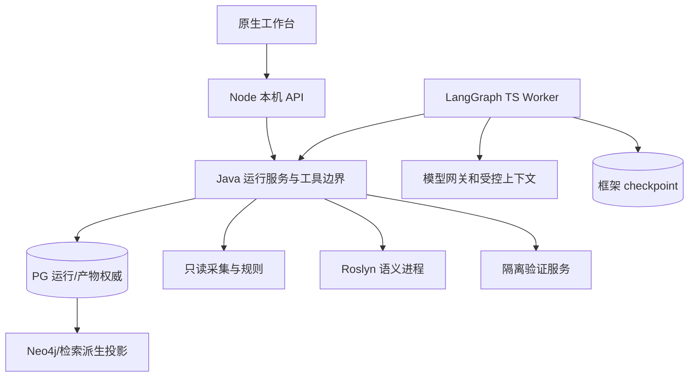

# ArchLens 自主迁移设计 Agent：实施设计

<!-- 2026-09-30：按批准的目标设计重建；旧设计原字节保存在 2026-09-29 归档。新协议、表和目录均待实现。 -->

重建完成日期：2026-09-30。依据：[详细设计 v2.0](../../../docs/design/ArchLens-自主迁移设计Agent-详细设计-v2.0.md)、[现有项目总结](../../../docs/design/ArchLens-现有项目总结-2026-09-29.md)。配套：[需求](requirements.md)、[任务](tasks.md)、[验收](check_list.md)。[旧设计归档](../../../docs/archive/2026-09-29/ArchLensService/specs/implementation/design.md)保留原接口、日期和实现记录。

本文件把 MD-D01–20 转为实施边界，使用同编号 MIG-D01–20 追踪 MIG-R01–20。除明确标为“现有”的能力外，以下组件、接口、表、状态和行为都是待开发设计，不能据本文调用不存在的 API。

## MIG-D01 交付范围与完成对象

A0 交付调查报告；A1 交付结构化迁移设计及验证计划；A2 在隔离环境完成约定的设计验证。A3 修改真实项目、业务数据迁移和生产切换不在本轮实现范围。

首次运行冻结 acceptanceScope：必需来源、模块/对象/关键路径、约束、不变量、验证等级及可接受未知项。后续调整需要新修订。完成检查针对该范围，不对未检查的全仓库作保证。首个样例采用小型 .NET 数据访问模块/MySQL 合成库，目标 Java、目标数据库版本/模式在样例配置中明确，不硬编码“所有 .NET 转 Java”或“所有数据库转金仓”。

## MIG-D02 请求、来源与正常旅程

| analysisMode | 必需来源 | 缺失处理 |
| --- | --- | --- |
| CODE_ONLY | 授权代码来源 | 无业务库时明确数据行为未知，不要求无关连接 |
| DATABASE_ONLY | 业务源或声明为离线的结构 | 无代码时明确应用影响未知 |
| JOINT | 代码与业务库 | 缺来源阻塞联合覆盖；用户变更范围才降为单项 |

MigrationRequest 包含 schemaVersion、analysisMode、sourceRefs、objective、targetEnvironment、constraints、invariants、acceptanceScope、policyRefs、modelConfigRef、budget。宿主保存授权来源、凭据引用和执行策略；可序列化请求不含连接密码。声明技术画像与观测画像分别存储，冲突进入调查任务或澄清。

正常流程：校验并入队→建立基线→调查 DAG→按需取证→缺口/澄清→方案比较→结构与独立审查→允许的验证→修订→完成检查→封存。查看和故障恢复不改变请求；答案、目标、范围或策略变化产生新请求哈希和新业务修订。

## MIG-D03 技术决策

| 组件 | 决策 | 实施约束 |
| --- | --- | --- |
| 编排 | 独立 LangGraph TypeScript worker | P0 锁定 Node/TS/LangGraph 版本，实测检查点导入和中断重放 |
| 模型 | 自有 ModelGateway，按需用 LangChain 组件 | 供应商切换不改变工具权限、数据策略和业务契约 |
| 分析 | 复用 Java 21 核心 | 事实、规则、证据、范围校验不移入提示词 |
| .NET 语义 | 独立 Roslyn 进程 | C#/VB 能力分别声明；F# 继续盘点，不能借 Roslyn 名义宣称绑定 |
| 存储 | PG 权威，checkpoint 独立 schema | Neo4j/向量索引均为派生投影，首例无需依赖其上线 |
| Agent 数量 | 单主规划器与独立审查步骤 | 后续可并行独立任务，模型一致意见不是验证 |
| 部署 | 本机单用户，保留原生页面 | 不在本轮引入 Vue/Spring Boot 或公网多租户 |

新依赖记录 engines、lockfile、许可证和部署影响。当前 Node 18+、Java CLI 及手写 Agent 是既有基线，不代表新 worker 已可运行。

## MIG-D04 进程与目录边界

Node 创建/查询业务运行，不依赖 HTTP 请求持续存活来执行长任务。Java 独占业务状态写入、授权登记、租约、工具参数/结果校验及封存。worker 可写专属 checkpoint，但不能直接操作事实/终态表。验证服务只写作业状态和不可变结果，不能直接推进方案。

拟议代码位置：Java `src/main/java/io/archlens/migration/`、`runtime/`；TS `ArchLensService/agent-runtime/src/{graph,context,model,bridge}/`；Roslyn `ArchLensService/analyzers/dotnet/`；验证适配 `ArchLensService/validation/`。这些目录按任务落地，不以创建空骨架计完成。首期 Java 桥接使用受控 JSON Lines；后续进程部署调整不改变工具契约和权威边界。

## MIG-D05 契约、身份与版本

| 对象 | 必需身份/引用 | 关键约束 |
| --- | --- | --- |
| MigrationCase/Run | caseId、runId、revision、requestHash | Case 独立最新修订；固定请求不原地改写 |
| SourceSnapshot | snapshotId/hash、sourceHashes、collectorVersions、consistency、coverage | 多来源观察集合不冒充原子快照 |
| Evidence/Finding | subjectId、sourceHash、location、producerVersion、ruleRef、outcome | 事实由工具生成；候选与绑定保留区别 |
| Hypothesis | claim、supportRefs、counterEvidenceRefs、verificationNeeded | 模型推断有独立类型，不能注入事实图 |
| InvestigationTask | taskId、planVersion、dependencies、capability、status、attempts | 调查 DAG，不是开发实施工单 |
| MigrationPlan/WorkItem | planHash/version、scope、workItemId、reasonRefs、validationRefs | 绑定当前请求/快照；工作项依赖无环 |
| ValidationRecord | validationId、planHash、snapshotHash、environmentHash、testSpecHash | 结果不可变，保存执行者/断言/受控日志 |
| DecisionRecord | decisionId、options、choice、reasonRefs、decisionSource | 区分模型建议、已确认业务取舍及范围接受 |

请求、计划、工具、事件分别使用 `archlens.migration-request.v1`、`archlens.migration-plan.v1`、`archlens.tool-envelope.v1`、`archlens.migration-event.v1`。它们不覆盖现有 `archlens.agent.v1/v2` 或调查报告 v1–v5。领域记录和边界报文拒绝未知版本/字段/枚举；框架内部状态另记 graphVersion/stateSchemaVersion。

JSON Schema 作为 TS/Java 共同契约来源，canonical JSON 的数字、空值、省略字段、排序和 Unicode 行为用跨语言黄金样例固定；内容哈希字段自身不参与自身摘要，时间/观察元数据的哈希范围在对应 Schema 明确，不能由两端各自猜测。

所有有效引用绑定运行、修订和快照；跨运行复用产生导入记录，保留原始 hash/来源和新范围核验结果，不改写旧对象身份。代码对象身份包含项目/TFM/编译条件；数据库对象包含源、目录、模式、类型和原始标识符。稳定别名仅用于模型投影，本地可反查身份。

## MIG-D06 采集与语义工具

现有 [InvestigationEngine](../../src/main/java/io/archlens/investigation/InvestigationEngine.java)、[DotnetInventoryAnalyzer](../../src/main/java/io/archlens/investigation/dotnet/DotnetInventoryAnalyzer.java)、[DatabaseCollectors](../../src/main/java/io/archlens/investigation/database/DatabaseCollectors.java) 和候选关联可封装为初始工具。复用时保留原限额/诊断，不将一次源码封装标为语义增强。

本地读取逐次校验真实路径、符号链接、包含/排除范围和预算；Git 固定 commit，独立副本，不执行 hooks，明确 submodule/LFS。SourceSnapshot 保存内容哈希和观察一致性；来源漂移使受影响结果失效，并创建新修订重新采集，旧封存保留。

Roslyn 输入为已授权源码、明确引用程序集/编译条件和项目身份，输出符号及绑定证据。静态模式不运行项目 analyzer、generator、MSBuild 或 restore。引用缺失时输出覆盖缺口；ADO.NET/EF6/EF Core/Dapper、Web/桌面/服务框架按适配器逐项注册。

数据库元数据和对象定义由固定系统目录查询/驱动适配获取；不开放任意 SQL。各产品单列版本、模式、对象类别、权限、TLS 及实库验证。默认不读业务行；统计/抽样是另外授权的能力，不能悄然纳入迁移调查。

跨来源路径各边分别记录证据与等级：入口→方法→访问 API→SQL/ORM→对象。保持 `CANDIDATE/AMBIGUOUS/UNKNOWN`，新绑定产物引用原候选而不直接改写其等级。覆盖分母来自授权范围，分别计数发现/纳入/采集/解析/符号绑定/对象绑定/规则/验证。

## MIG-D07 源目标能力与知识

SourceFeatureProfile 记录实际使用的源能力；TargetCapabilityProfile 记录指定产品/版本/模式/配置的目标能力；MappingRule 记录通用映射条件；PairExceptionRule 记录具体方向例外。规则适用判断先验证版本、模式、配置及证据前提，再输出规则结果，缺项返回 UNKNOWN。

映射检查涵盖精度/值域、时间/时区、空串/NULL、大小写/排序、JSON/LOB、生成键、约束/索引、SQL/过程、权限、驱动、事务/锁/重试以及同步方式。源→目标不能倒转使用；PostgreSQL 规则不能直接当 KingbaseES 规则。

知识检索记录官方来源、适用版本、抓取时间、内容哈希及引用。检索/模型提出的规则进入候选记录，经过正反例、版本核对与发布审阅后才进入正式规则包。组合目标统一检查依赖、事务和部署冲突，比较先迁语言/数据库或分模块过渡，缺业务参数时不虚构双写/停机可行性。

## MIG-D08 计划及导出

MigrationPlan 字段组：identity、objectiveAndScope、currentArchitecture、alternatives、targetArchitecture、mappings、workItems、validationPlan、rolloutAndRollback、assumptionsAndGaps、evidenceAndDecisions、estimates。备选不足、估算缺依据或某一领域不适用时明确原因，不能用空段落伪装完整。

MigrationWorkItem 包含稳定 ID、标题、源对象、原因/证据/假设、变更说明、dependsOn、前置条件、预期产物、完成标准、验证项与优先级依据。结构检查拒绝环、悬空依赖、跨范围对象与缺必要字段。InvestigationTask 的完成不自动把开发工作项标为已实施。

版本化 JSON 为权威计划；Markdown 和页面由同一结构生成，导出保留范围、未知项、验证状态和来源引用。草案/封存分开，封存内容不可变；后续 Word/PDF 仅作呈现适配。

## MIG-D09 图循环、任务和上下文

节点序列为 validate_request→establish_baseline→plan_investigation→choose_next_task→collect_or_analyze→assess_gaps→synthesize_design→review_design→validate_design→evaluate_completion→request_seal。允许缺口/反例回到调查或设计，允许澄清/外部等待暂停；执行前置条件由 Java 和确定性图路由检查。

State 仅保存固定请求/快照引用、任务、问题、假设、方案/验证引用、预算摘要、事件游标和带引用的工作摘要；不保存凭据、连接对象和完整源码。重要决定入 DecisionRecord，摘要不能成为事实。模型调用按任务检索上下文，保留约束、反证和未决项。

任务状态 PLANNED→READY→RUNNING→SUCCEEDED/BLOCKED/FAILED/SKIPPED；重试新尝试有计数和预算，SKIPPED 必带原因且计入覆盖缺口。建议连续两轮无新增证据、有效任务变化或可用反馈时 PARTIAL/NEEDS_INPUT；具体初值在 P1 样例固定。独立审查使用不同上下文检查遗漏、冲突和验证空白，不通过投票宣布兼容。

## MIG-D10 业务状态、持久化与恢复

### 10.1 状态维度和转换

| 维度 | 值 | 权威 |
| --- | --- | --- |
| executionState | QUEUED、RUNNING、NEEDS_INPUT、WAITING_EXTERNAL、COMPLETED、PARTIAL、FAILED、CANCELLED、SUPERSEDED | Java/PG |
| designStatus | DRAFT、BLOCKED、READY_FOR_REVIEW、ACCEPTED_FOR_SCOPE、SUPERSEDED | 结构门槛与记录主体，接受须绑定 planHash/范围 |
| validationStatus | NOT_RUN、RUNNING、PASSED_FOR_SCOPE、FAILED、INCONCLUSIVE | 验证服务及覆盖核验 |
| rule outcome | COMPATIBLE、INCOMPATIBLE、CONDITIONAL、UNKNOWN | 已发布规则与证据 |

| 起点/事件 | 结果 | 必要原子检查 |
| --- | --- | --- |
| 创建请求 | QUEUED | 宿主提交幂等键、请求 hash、case/revision 分配 |
| QUEUED 领取、RUNNING 租约过期接管 | RUNNING/新 epoch | 当前修订、可领取状态、租约过期或空闲、worker |
| RUNNING 续租 | RUNNING | 同 worker/epoch、未过期、未取消，PG 时钟 |
| RUNNING 请求澄清 | NEEDS_INPUT | 问题/父产物/认可 checkpoint 持久，旧票据失效 |
| RUNNING 等外部作业 | WAITING_EXTERNAL | 作业已登记、认可 checkpoint 持久，旧票据失效 |
| NEEDS_INPUT 回答 | 旧 run SUPERSEDED、新 run QUEUED | 父 hash/问题集/expectedRevision、答案幂等键一次消费 |
| WAITING_EXTERNAL 作业可消费 | 领取后 RUNNING/新 epoch | 同固定请求、最新修订、有效作业结果、重新核验权限 |
| RUNNING 封存 | COMPLETED/PARTIAL | 第 13 节门槛、租约/epoch/请求/修订与产物 hash |
| 活跃/暂停运行取消 | CANCELLED | epoch 增加、幂等回执；终态不会因重复取消改写 |
| 不可恢复失败或预算停机 | FAILED 或封存 PARTIAL | 错误及可用产物保存，原运行不原地变回活跃 |

COMPLETED/PARTIAL/FAILED/CANCELLED 是不可恢复执行终态；重试创建新修订。SUPERSEDED 表示被新输入取代的运行；已封存报告正文和原回执不变，用独立继任关系/历史视图表达其被取代。活跃或暂停 run 被新修订取代时应原子失效票据。ACCEPTED_FOR_SCOPE 另存接受事件，不改写封存计划字节，也不把范围外能力升为通过。

### 10.2 新表与旧数据

| 新逻辑表 | 内容/唯一性 | 写入者 |
| --- | --- | --- |
| migration_case / migration_run | 独立 latest_revision；唯一 case+revision、runId；固定请求/类型/状态/租约/epoch | Java 运行服务 |
| migration_task | taskId/planVersion、DAG、尝试、结果引用 | Java 工具/运行服务 |
| tool_invocation | invocationId、稳定去重键、输入/工具/快照 hash、结果 | Java 工具边界 |
| migration_artifact | 类型/版本/范围/内容 hash、不可变位置、导入依据 | 产物服务 |
| migration_event | run/revision、单调 eventId、受控摘要 | 业务事务内事件 |
| migration_question / migration_answer | 问题集/父产物、回答 hash、消费/幂等身份 | Java 澄清服务 |
| validation_job | 稳定 jobId、环境/输入/测试 hash、作业状态/结果 | 验证服务 |
| checkpoint_link | 认可 checkpoint、graph/stateSchema、epoch、sequence、状态 hash | Java CAS 更新 |

通过追加数据库迁移创建；不改 [V001](../../src/main/resources/db/V001__investigation_storage.sql) 校验和。旧 [PgInvestigationStore](../../src/main/java/io/archlens/storage/PgInvestigationStore.java) 的 investigation_case/run 保持旧状态、修订、封存哈希和来源 checkpoint；不能把新 COMPLETED 写入旧枚举。旧报告仅通过 legacyRunRef/sourceReportHash 显式导入，不更新旧 latest_revision。

框架 checkpoint 使用独立 schema/权限/保留策略；worker 不能直接写上述业务表。每 run 的编排类型固定；旧 LEGACY 与新 LANGGRAPH 各自只有一个所有者，新运行不能嵌套旧模型循环。

### 10.3 租约、暂停、澄清及外部等待

宿主票据绑定 workerId、runId、revision、epoch、requestHash、授权策略和期限。工具派发、结果消费、checkpoint 认可、续租、封存均校验状态/当前修订/epoch/租约。建议原型租约 180 秒、30 秒内续租，以 PG 时钟为准；过期票据不能靠迟到心跳复活。取消/暂停/取代均使旧票据失效。

暂停步骤：保存产物和问题/作业→保存框架 checkpoint→Java 校验并认可该引用→在业务事务内写暂停状态、事件并失效租约。中途崩溃时仍以最后已认可业务状态和调用账本恢复，不能仅凭框架“已中断”判业务暂停成功。

回答携带 questionSetHash、parentArtifactHash、expectedRevision 和宿主幂等键；Java 原子消费答案、分配下一 revision、使旧 run SUPERSEDED 并创建新请求。新 run 从 validate_request 和新 thread_id 开始，核验后显式导入可复用产物/任务并重新规划。禁止对旧 interrupt 执行 Command(resume) 后替换请求身份；框架 resume 仅用于同固定输入运行的受控恢复。

WAITING_EXTERNAL 释放执行租约后，验证服务凭作业身份写 validation_job/不可变结果，只发唤醒事件；新 worker 领取新 epoch，检查当前修订和作业绑定后消费。已取消/取代时仅保留作业历史，不推进任务/计划。作业取消与资源回收有独立结果，不假设运行取消能瞬时终止外部执行。

### 10.4 认可 checkpoint 与恢复算法

1. Java 原子核对当前修订和可领取状态，分配新 epoch/租约。不能领取仍有效的其他 worker 租约。
2. 读取 PG checkpoint_link，核验 graphVersion/stateSchemaVersion、请求/来源、引用产物及策略。无认可 checkpoint 时从入口和已登记幂等账本重建，不从任意最新框架记录恢复。
3. thread_id=runId，namespace 包含 graphVersion/epoch；适配器把核验后的状态导入新 epoch namespace。同 epoch 内命名空间稳定，不能假设只改配置就自动继承状态。
4. 新检查点写好后，通过 CAS 校验 worker/epoch/租约、预期旧指针、递增 checkpointSequence/事件游标；旧 worker 写旧 namespace 或同 epoch 回调乱序均不能倒退认可指针。并行子图由主图汇合认可。
5. 先对账 tool_invocation/validation_job，再恢复图。中断节点开头可能重放，只能只读或调用稳定幂等操作。
6. 来源、目标、规则或策略不适用时使相关产物失效并按输入变化建立新修订。graph/stateSchema 不兼容时显式适配或新运行，禁止盲目反序列化旧检查点。

状态导入是 P0 必须在所锁 LangGraph 版本上验证的适配能力，不由框架默认自动保证。checkpoint 与业务表不使用跨系统事务，顺序持久化、认可指针和账本对账提供恢复保障。

### 10.5 工具幂等与崩溃窗口

宿主在派发前生成 invocationId；去重身份绑定 runId、稳定任务/动作身份、任务版本、toolVersion、规范化输入 hash、snapshotHash，epoch 不参与，模型不能任意选幂等键。对重放的同一动作回读同一调用；明确需要再次观察或重跑时先生成新任务版本/动作身份。跨运行复用走显式导入而非撞同一调用 ID。

| 中断位置 | 对账恢复 |
| --- | --- |
| 登记调用后、未派发 | 同 invocationId 派发 |
| 工具完成/结果保存、checkpoint 未推进 | 回读不可变结果，幂等推进任务，不重复作业 |
| 作业已启动、回执丢失 | 按 validationJobId 查询，不重复启动 |
| checkpoint 有记录但业务未认可 | 忽略未认可前进位置，按最后指针与账本恢复 |
| 取消/取代后结果返回 | 隔离为迟到/历史结果，不更新 run/plan |
| 模型请求回执保存失败 | 记录可能重复计费，按剩余预算有限重试；不宣称恰好一次 |

同一封存请求重复到达时，在 planHash/requestHash 与终态一致条件下返回原回执；冲突内容拒绝。数据库事务以条件更新和唯一约束保证一次业务提交，模型/网络调用成本不保证恰好一次。

## MIG-D11 工具协议和失败分类

工具目录分为授权发现、符号/依赖/证据读取、数据库采集/定义、版本知识、确定性规则/影响、方案检查、隔离作业和澄清/封存。Manifest 明确 toolId/version、Schema、能力范围、权限、资源上限、超时/重试/幂等行为。旧六工具保持旧协议，新工具独立发布。

TS→Java 信封：protocolVersion、requestId、runId、revision、epoch、invocationId、snapshotHash、toolId、toolVersion、arguments、budget、capabilityRef；宿主票据走不可进入 prompt 的受控字段。响应：status、artifactRefs、diagnostics、coverageDelta、retryability、elapsedMillis。大结果只返回授权 artifactRef，不开放任意文件路径。

UTF-8 JSON Lines 的大小上限、超时、进程退出码和错误码在 P0 合约固定；参数数组启动进程，不拼 shell。stdout 仅协议，日志独立。权限/票据失效不重试，临时网络故障有界退避，能力缺失返回 UNKNOWN/缺口，存储失败禁止成功回执，模型失败保留确定性产物和部分草案。

## MIG-D12 上下文与权限

SUMMARY_ONLY→匿名规则与数量；SCOPED_SEMANTICS→稳定别名/结构关系和必要属性；SCOPED_SNIPPETS→明确授权范围内有限源码/对象片段。未配置新策略时保持 SUMMARY_ONLY；私有模型也不能扩大来源权限。每次请求记录策略版本、范围、证据及投影 hash，实际正文按本地受控保留策略保存。

密码、token、连接串、业务行和敏感日志不进入模型/checkpoint/导出；源码、定义及用户文本需敏感检测，删改影响判断时留下缺口。外部内容作为数据，不能选择新端点或改变工具权限。云 trace 默认关闭，启用需要独立的数据范围/保留配置。

## MIG-D13 验证服务与封存门槛

V1 验 Schema、引用、版本、DAG、覆盖；V2 验已实现类型映射、接口/依赖/SQL/配置冲突；V3 在独立账号/环境执行样例构建、SQL/DDL、契约/差异测试。静态调查继续不执行项目；restore/generator 只可在显式隔离执行模式受控运行。资源限制包含 CPU、内存、时长、磁盘、网络和作业数；数据库临时对象用已登记模板创建/清理，清理失败记录并限制后续分配。

ValidationRecord 保存命令模板、镜像/工具/驱动版本、environmentHash、输入及 testSpecHash、退出码、断言和受控日志。人工导入默认 EXTERNAL_UNVERIFIED。关键假设/不变量必须指向验证或明确外部确认；验证通过只覆盖选定样本和环境。

Java evaluate_completion 检查：必需来源可用；必需对象有处置；关键约束有决策；必需工作项字段及验证齐全；无未解决阻塞冲突；来源/预算仍有效；必需执行验证全部必需断言通过并匹配最终 planHash/snapshotHash/environmentHash/testSpecHash。FAILED/INCONCLUSIVE/NOT_RUN/旧计划通过记录均不满足必需执行项。

修改计划后重跑受影响验证；通过确定性依赖核验可复用者保存显式重绑定记录，不能篡改原结果 planHash。A1 本就不要求的 V3 可 NOT_RUN 并交付 READY_FOR_REVIEW；A2 缺环境保持 BLOCKED/PARTIAL。模型 finish 只能请求检查。ACCEPTED_FOR_SCOPE 须有绑定 planHash、范围和确认主体的独立决策。

## MIG-D14 API、事件与凭据

| 接口（拟议） | 行为 |
| --- | --- |
| POST /api/migrations | 校验/幂等创建/入队，202 返回真实 caseId/runId/revision |
| GET /api/migrations/{runId} | 三维状态、预算、缺口和最新修订标记 |
| GET /api/migrations/{runId}/tasks、/events | 分页任务和单调事件游标，支持断线回读 |
| GET /api/migrations/{runId}/questions | 问题集 hash、父产物和阻塞范围 |
| POST /api/migrations/{runId}/answers | 原子创建下一修订，重复回原回执，冲突拒绝 |
| POST /api/migrations/{runId}/cancel、/retry | 取消失效票据；retry 针对终态创建新修订，同固定输入的活跃运行故障接管由调度器在原 run 内完成 |
| GET /api/migrations/{runId}/plan、/artifacts/{artifactId} | 明确版本/草案/封存，校验所属范围 |
| POST /api/migrations/{runId}/validation-jobs、/decisions | 验证授权去重、绑定方案的决策/接受 |
| GET /api/migrations/{runId}/export | 同结构 JSON/Markdown，保留封存 hash |

凭据另由本机接口登记不透明 credentialRef，按来源/权限/时效校验；重启未恢复时请求重绑，秘密不入固定请求。数据源身份不变的密码轮换不新建修订，其他身份/策略变化需重新核验。错误统一 code/message/retryable/correlationId/relatedRefs，不回显供应商/驱动原始秘密。

事件含 RUN_CREATED、TASK_STARTED、EVIDENCE_ADDED、QUESTION_RAISED、PLAN_REVISED、VALIDATION_FINISHED、RUN_SEALED、RUN_CANCELLED，事务内记录受控摘要，按游标回读。事件重放不能导致客户端虚构终态；以 PG 查询和回执为准。

## MIG-D15 工作台

复用三模式表单、新增来源/环境、任务、证据、方案比较、工作项、验证/决策、历史/导出面板。请求权限和数据策略是用户可理解选项，内部 epoch/checkpoint 不成为业务表单字段。候选、未运行、未知、草案和封存分别标识，断网回读进度，不随机估计百分比。用户回答后转到新修订，旧历史只读。交互验收包括键盘、中文错误、窄屏与下载内容一致性。

## MIG-D16 预算、缓存和运维

共享预算账本在派发前预留、完成后结算模型/token/工具/时长/并发/文件对象/重试/验证资源；恢复不得重置累计消耗。原型建议 20 分钟、32 次模型、64 次工具、1 个模型/2 个只读工具/1 个验证并发，均待 P0/P1 实测定版，不是当前容量保证。旧采集限额继续有效。

缓存键包含来源、解析器/规则、目标条件和投影策略；模型结果另含模型配置/提示版本。数据库缓存校验权限和观察时效，不按库名直接命中。引用依赖决定增量失效；封存记录不可变。

本机启动器管理 API/worker/Java，任务不依赖浏览器。日志只含受控事件、哈希、成本/耗时/错误；备份同时包含 PG、checkpoint 和产物，恢复核对引用/hash。垃圾回收先算封存可达引用，不能删除仍被依赖的证据。多用户鉴权、租户/配额和公网部署另行设计。

## MIG-D17 兼容发布

现有 [AgentOrchestrator](../../src/main/java/io/archlens/agent/AgentOrchestrator.java)/CLI/网页调查和预览不改名冒充新能力。旧输入/报告按原 schema/hash 回读；新 API/表/状态独立。新增能力关闭时旧功能继续，新运行须由匹配版本恢复或明确停止/新修订。历史报告导入保留能力限制，不将旧 PARTIAL 重新解释为完整设计。

现有 FactGraph 的 dependent→dependency 和证据身份继续保留；新候选/推断不进入权威事实边。Neo4j 失败不丢 PG 结果，投影仍可重建。每次契约变化更新消费者、示例及回归，保留用户已有本地源码工作。

## MIG-D18 分阶段交付

P0 契约/框架恢复原型，P1 草案闭环，P2 语义与方向规则，P3 隔离验证，P4 产品/版本扩展和运行质量。每阶段依赖、文件职责、通过条件和 MD-AC 映射见 [tasks](tasks.md)；所有新阶段当前待开发。

## MIG-D19 验收与评测

[check_list](check_list.md)逐条承接 MD-AC01–28，记录未来真实证据，不迁移旧勾选。离线桩、真实模型、厂商实库、浏览器和故障恢复分别保留输入、环境、断言及结果；子范围通过不使总项自动通过。质量评测同时记录覆盖、误报、遗漏、无依据建议、人工修改量、成本及时延。

## MIG-D20 追踪与变更管理

MIG-Rxx→MIG-Dxx 对应同编号 MD-Dxx；任务编号与验收编号建立显式多对多映射。旧 INV/TASK/历史测试计数只在归档保留，新的完成状态必须有新日期、代码基线、环境和证据。仅文档重建不构成新框架或产品能力通过；本轮测试资源迁移回归独立记录。改变范围、上下文策略或执行模式时同步需求、设计、任务、验收和工程约束。
