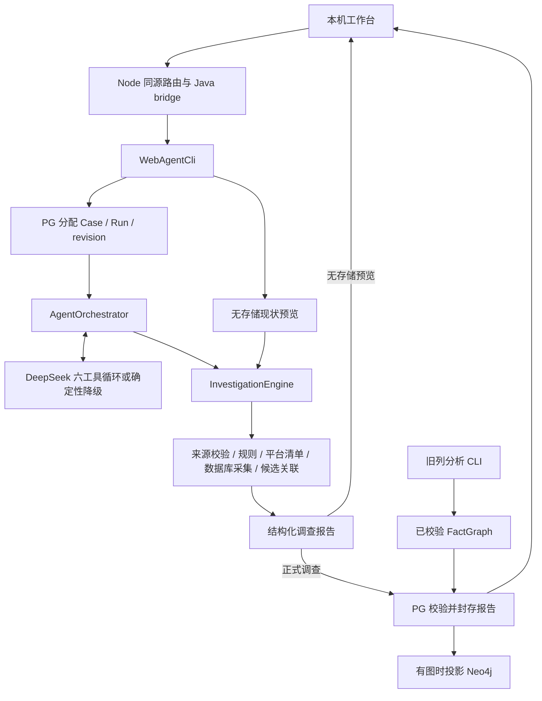

# ArchLens 现有项目总结

文档日期：2026-09-29。性质：当前工作区实现基线与历史验证索引，供后续重新编制 spec 使用。

> 2026-09-30 文档整理补记：本文初稿的“本次”指两份设计资料创建阶段。随后已根据本文重建[当前 specs](../../ArchLensService/specs/implementation/requirements.md)，旧资料转入[历史归档](../archive/2026-09-29/README.md)。本次仅调整历史引用路径与本说明，设计内容及原核查、验证日期不变。

配套目标设计：[ArchLens 自主迁移设计 Agent 详细设计 v2.0](ArchLens-自主迁移设计Agent-详细设计-v2.0.md)。本文记录现状；配套设计描述后续目标，不将其中的 LangGraph、语义工具或迁移计划能力计入现有实现。

## 1. 核查口径与结论

本次依据当前源码、模块说明、实施规格及有日期的验证记录进行静态核对。没有运行构建、模型调用、业务数据库连接或产品验收，也没有复核当前后台服务是否运行。文中测试数字均属于原记录日期。

工作区原本已有大量未提交修改和新增文件，包含 .NET 清单、业务数据库、访问路径等功能；这些内容作为当前实现基线记录，不能归为本次新增。本次仅在 `docs/design/` 新增设计资料，既有代码、README、spec、验收记录和其他文档保持原样。

**ArchLens 当前是本机单用户的只读调查工作台，包含确定性分析核心和受限模型工具循环。** 它已能采集授权代码与部分数据库结构，输出可追溯调查报告、有限兼容规则发现和静态候选关联；尚未具备自主完成完整迁移设计、实施迁移或证明业务等价的能力。

主要可复用资产是证据和版本契约、来源校验、Java 规则与采集器、PG 修订封存、受限工具执行以及现有工作台。主要缺口是语义证据读取、可恢复长任务规划、结构化迁移方案、目标能力分析和隔离验证反馈。

## 2. 产品范围与用户输入

历史起点是数据库列变更影响分析；现已扩展为“代码来源 + 按需业务数据库 + 自然语言目的”的调查入口。代码来源目前是服务所在机器的授权本地目录与显式文件清单，尚无 Git URL 拉取及固定提交采集。

| 分析模式 | 必要输入 | 现有产物与边界 |
| --- | --- | --- |
| 仅代码 | 授权根目录、相对文件清单、目标与约束 | 显式来源清单、适用规则、.NET 声明盘点；无业务库也可调查 |
| 仅数据库 | 受支持业务库连接与对象范围、目标与约束 | 连接测试、当前账号可见结构；允许代码目录和文件清单为空 |
| 代码 + 数据库 | 两类来源均提供 | 同份报告合并代码、结构及静态候选关联；不等于运行时调用链已绑定 |

目标环境可记录数据库产品/版本/兼容模式、操作系统/版本、CPU 架构、运行时/版本。当前只保存声明，并产生 `TARGET_ENVIRONMENT_DECLARED_NOT_ASSESSED`；不会因填写目标金仓或国产 OS 就完成适配判断。

目标场景枚举包括 `CURRENT_STATE`、`COLUMN_CHANGE`、`DATABASE_MIGRATION`、`LANGUAGE_MIGRATION`、`REFACTORING`、`DEPENDENCY_UPGRADE`。枚举存在不代表场景的全部语义已实现。网页拒绝旧 `COLUMN_CHANGE` 适配输入，旧列能力仍通过 CLI 使用。

代码单项的无存储预览当前专门支持 .NET；数据库与联合预览复用 `preview-joint`。这些预览没有 Run ID、不进入历史，也不执行完整的自然语言目标分析。正式网页调查必须有 ArchLens 自身 PostgreSQL，模型缺失时可确定性降级。

信创改造是包含平台、依赖、数据库和部署约束的后续目标，不默认等于 .NET 转 Java；当前没有完整组合目标的评估器。

## 3. 技术栈与目录

| 层次 | 当前实现 | 尚未采用 |
| --- | --- | --- |
| 网页 | 原生 HTML/CSS/JavaScript；Node.js 18+ 本机服务 | Vue、React 或生产门户框架 |
| 后端 | Java 21、Maven 3.9.x、打包 CLI，Node 启动 Java 子进程 | Spring Boot 常驻 API 服务 |
| 模型 | DeepSeek 原生 `tool_calls` 与手写 Java 编排器 | LangChain、LangGraph、LangChain4j、Spring AI |
| 解析 | JavaParser 3.27.1、JSqlParser 5.3、XML 与自有词法处理 | Roslyn、完整多语言符号与数据流引擎 |
| JSON/测试 | Jackson 2.18.3、JUnit 5.12.2、Node 内置测试 | 完整跨语言 JSON Schema 发布体系 |
| 自身存储 | pgJDBC 42.7.13、Neo4j Java Driver 5.28.9 | 持久任务队列、LangGraph 检查点存储 |
| 业务库驱动 | MySQL Connector/J 9.7.0；其他厂商 JAR 外部配置 | 全部厂商驱动随产物统一分发 |

以上版本来自 [pom.xml](../../ArchLensService/pom.xml) 和 [package.json](../../ArchLensClient/package.json)，是当前固定依赖，不表示本次检查了最新发行版或完成依赖安全审计。

| 路径 | 职责 |
| --- | --- |
| [ArchLensClient](../../ArchLensClient/) | `index.html`、`workbench.js`、`workbench.css` 构成当前首页；`draft.html`、`app.js` 保留旧草稿流程 |
| [server.mjs](../../ArchLensClient/server.mjs) / [investigations.mjs](../../ArchLensClient/investigations.mjs) | 静态文件、同源边界、调查路由、并发限制、Java JSON 行协议 |
| [contract](../../ArchLensService/src/main/java/io/archlens/contract/) | IR、稳定身份、canonical JSON、不可变事实图、关系与属性校验 |
| [parser](../../ArchLensService/src/main/java/io/archlens/parser/) / [analysis](../../ArchLensService/src/main/java/io/archlens/analysis/) | 授权来源读取、旧 Mapper 分析、ChangeSpec、反向传播和风险区间 |
| [investigation](../../ArchLensService/src/main/java/io/archlens/investigation/) | 统一来源采集、预算、报告、规则、.NET 清单与数据库联合调查 |
| [agent](../../ArchLensService/src/main/java/io/archlens/agent/) / [llm](../../ArchLensService/src/main/java/io/archlens/llm/) | 受限模型循环、澄清、匿名摘要解释；旧目标提议网关 |
| [storage](../../ArchLensService/src/main/java/io/archlens/storage/) | PG Case/Run/修订/封存与 Neo4j 事实图投影 |
| [cli](../../ArchLensService/src/main/java/io/archlens/cli/) | 离线、Agent、存储及网页 Java 协议入口 |
| [examples](../../ArchLensService/examples/) / [src/test](../../ArchLensService/src/test/) | 合成输入、有限规则正反例及需显式启用的真实集成测试 |

`.local/`、`target/` 是机器配置、缓存或构建输出；`qa/` 主要是历史设计文件排版材料，不能当作产品验收证据。业务库与 ArchLens 自身存储是两套用途不同的连接配置。

## 4. 现有端到端调用链

正式提交先校验输入、授权目录及业务连接绑定，再分配真实票据并返回 HTTP 202；Java 在后台执行，网页轮询 PG 状态。Node 的本次进程继续等待 Java 结束，但不是持久作业调度器，进程退出后不自动从中间工具继续。

`InvestigationEngine` 当前版本为 `archlens-investigation-0.8`。它读取显式来源、逐步保存来源检查点、执行适用规则及独立盘点、采集业务结构、复核来源哈希，再建立静态候选关联。来源漂移、取消或关键预算超时会撤销不再有效的发现与清单，保留来源和覆盖缺口。

报告始终保留整体未检查范围的 `UNKNOWN`。程序没有从“局部规则兼容”推导“全项目可迁移”的完成状态。来源最终重查能够发现一般漂移，但没有建立跨文件、跨数据库的原子快照。

## 5. 确定性分析与规则资产

旧列分析通过 JavaParser 检查指定 Java 接口的有限无参抽象方法，通过 MyBatis namespace/id 做有限唯一绑定，通过 JSqlParser 处理单表静态 SELECT 与有限 WHERE 直接列引用。其离线 catalog 是输入断言，保留 `OFFLINE_CATALOG_UNVERIFIED`。

旧事实图的边方向是 `dependent → dependency`，影响沿反向边传播，`CONTAINS` 不参与当前影响传播。`changeRequired=YES/NO/UNKNOWN`、影响强度、风险区间和置信度分别表达。展示路径数不代替全部已访问判断；传播有深度、节点、工作量和时间边界。

列改名、删除与有限类型变更使用 `ChangeSpec`。`UNVERIFIED_PROPOSAL` 不能直接充当绑定快照的 ChangeSpec；拟议兼容条件不等于已验证兼容。当前拒绝 `VERIFIED` 兼容声明与 `APPLIED` 变更，没有自动修改或行为验证引擎。

现有 [RuleCatalog](../../ArchLensService/src/main/java/io/archlens/investigation/rules/RuleCatalog.java) 为 `archlens-rules-1.1`，注册 **25 条**规则，逐条保存适用版本、所需事实、官方依据链接和复核日期。

| 场景/固定范围 | 规则 ID | 实际检查及限制 |
| --- | --- | --- |
| MySQL 8.0.x → PostgreSQL 16.x | `MYSQL_UNSIGNED`、`MYSQL_AUTO_INCREMENT`、`MYSQL_BACKTICK`、`MYSQL_IFNULL`、`MYSQL_SIGNED_INT` | DDL/SELECT 有限词法；signed INT 的兼容仅指裸声明值域 |
| Oracle 19c/19.x → PostgreSQL 16.x | `ORACLE_TYPE`、`ORACLE_DATE`、`ORACLE_EMPTY_STRING`、`ORACLE_NVL`、`ORACLE_NEXTVAL` | NUMBER/VARCHAR2、DATE、空串、函数和序列语法；无完整 PL/SQL |
| C# 12.x → Java 21.x | `CS_DECIMAL`、`CS_UNSIGNED`、`CS_AWAIT`、`CS_SERIALIZATION`、`CS_PROJECT_PROFILE`、`CS_PROJECT_DEPENDENCY`、`CS_PROJECT_REFERENCE` | 词法特征与项目声明；没有完整语义与行为等价证明 |
| Java 21.x → Java 21.x 重构 | `JAVA_API_CHANGE`、`JAVA_BODY_CHANGE`、`JAVA_STATE_CHANGE` | 显式前后 AST 比较与有限契约；需 `*.refactor.json` 文件对 |
| Spring Boot 2.7.x → 3.0.x | `BOOT_JAKARTA`、`BOOT_JAVA17`、`BOOT_SERVLET_DEPENDENCY` | 导入及直接 Maven 声明；不求 effective POM/传递依赖 |
| Java 8.x → 17.x/21.x | `JDK_JAXB` | JAXB 导入和目标 JDK 不再内置的条件风险 |
| HttpClient 4.5.x → 5.2.x | `HTTPCLIENT_NAMESPACE` | 命名空间替换/并存条件；不覆盖逐 API 或运行时行为 |

缺失或不支持的版本产生未知与澄清，不套用相近版本。MySQL **采集器支持 8.x**，而上述迁移规则只覆盖 **8.0.x**；MySQL 8.4 结构采集通过不能证明其到 PostgreSQL 的规则已实现。

规则发现使用 `COMPATIBLE/INCOMPATIBLE/CONDITIONAL/UNKNOWN`，附规则依据、证据和建议。C# await/序列化标记和 Java 同名调用仍可能只是候选。新场景没有复用旧列风险评分，也没有自动生成完整新场景事实图。

SQL/C# token 与 Java AST 可有精确原文 UTF-8 字节位置、1 起始 Unicode 码点行列及结束不包含范围；XML、比较计划、旧列分析仍有整文件证据，不能将一种粒度外推到全部分析器。

## 6. .NET 平台能力

依据：[DotnetInventoryAnalyzer](../../ArchLensService/src/main/java/io/archlens/investigation/dotnet/DotnetInventoryAnalyzer.java)、[dotnet-project.mjs](../../ArchLensClient/dotnet-project.mjs) 和 [.NET 使用说明](../archive/2026-09-29/ArchLensService/docs/dotnet-platform.md)。

已区分 .NET Framework、.NET Core、现代 .NET、.NET Standard；按项目记录多目标声明，识别 C#、VB.NET、F#，语言版本、SDK 版本和 TFM 分开。混合 .NET 调查允许没有统一源版本，不能把 net8.0 解释成 C# 8。

| 输入 | 已采集内容 | 仍未解决 |
| --- | --- | --- |
| `.sln` / `.slnx` | 解决方案项目引用声明 | 有效构建配置、外部引用自动采集 |
| `.csproj` / `.vbproj` / `.fsproj` | 旧式或 SDK 工程、框架、语言、输出/UI 声明 | MSBuild 求值、条件展开、SDK 默认项、生成器 |
| 包/程序集/框架/COM/项目引用 | 直接声明、目标是否已纳入采集 | 恢复包、传递依赖、实际引用绑定与调用图 |
| `global.json`、共享 props/targets、packages.config | SDK/共享/包声明 | 将共享属性有效应用到每个工程 |
| web/app.config、appsettings JSON | 白名单结构线索 | 配置值/连接串语义；非严格 JSON 格式 |
| C#/VB/F# 源文件 | 来源及哈希；C# 专项规则另行分析 | 平台清单语义绑定数量仍为 0，VB/F# 完整语义未实现 |

应用类型只是候选。声明清单使用 `WHOLE_FILE` 证据，不伪造 XML 元素精确位置；配置原始值及连接串不进入清单。未运行 MSBuild、restore、源生成器或被调查源码。

候选发现上限为 1000 文件、50 MB、10000 目录项、20 层、10 秒；排除构建/包缓存、生成文件和符号链接，超限整体失败。核心重新校验最终显式文件，不自动跟随发现的目录外引用。

## 7. 业务数据库能力与产品差异

依据：[DatabaseCollectors](../../ArchLensService/src/main/java/io/archlens/investigation/database/DatabaseCollectors.java)、[MysqlCollector](../../ArchLensService/src/main/java/io/archlens/investigation/database/MysqlCollector.java)、[JdbcMetadataCollector](../../ArchLensService/src/main/java/io/archlens/investigation/database/JdbcMetadataCollector.java)。

| 能力 | MySQL | Oracle / KingbaseES / DM |
| --- | --- | --- |
| 实现方式 | 固定、参数化系统元数据 SELECT；验证 MySQL 8.x | 通用 `DatabaseMetaData`；验证产品名称与模式可见性 |
| 对象范围 | 选定数据库 | 指定模式；Oracle 另需服务名，KingbaseES 另需数据库名 |
| 表/视图与字段 | 名称、类型、引擎、排序规则、完整类型、可空、extra、字符集 | 表/视图等驱动返回对象、字段顺序/类型名/可空；类型精度/长度表达不等同 MySQL 完整声明 |
| 键与索引 | 索引、主键、唯一键、外键及引用结构 | 索引、主键、外键；唯一性来自索引元数据，不保证完整唯一约束语义 |
| 扩展元数据 | 服务设置、CHECK、视图定义可见性/长度、过程/函数/触发器、参数及存在性标记 | 过程/函数名称；未实现同等 CHECK、触发器、参数、定义可见性和服务配置覆盖 |
| 只读与 TLS | 客户端只读并核验服务端会话；支持三种明确 TLS 模式 | 客户端只读标志；`DRIVER_DEFAULT`，服务端只读及 TLS 状态未核验 |
| 驱动 | Maven 固定 Connector/J | `ARCHLENS_BUSINESS_JDBC_JARS` 指向厂商 JAR，缺驱动明确失败 |
| 历史实库验证 | 隔离 MySQL 8.4.11 合成库 | 尚无各产品实库验收记录 |

MariaDB 和 PostgreSQL 业务源不在当前 `BusinessContext.Source` 支持产品中。自身存储使用 PostgreSQL，不等于已经具有 PostgreSQL 业务元数据采集器。

所有产品均不读取业务行；原始默认值、注释、CHECK、视图与存储程序正文不进入清单。MySQL 对部分定义只保存是否可见/长度，无法据此进行表达式或过程迁移设计。通用 JDBC 采集依赖驱动返回内容，不证明完整对象覆盖。

MySQL 默认 `VERIFY_IDENTITY`，另有 `REQUIRED`、`DISABLED`；主机字段不接受任意 JDBC URL，当前不支持 IPv6 或自定义 JDBC 参数。Oracle、KingbaseES、DM 使用固定产品 URL 模板及显式驱动类。

连接测试最多 10 秒，采集最多 15 秒并受总预算约束，连接/网络及单查询通常另有限时。MySQL 上限 200 表/视图，字段/索引列/约束列/CHECK 各 5000，视图 200、过程与函数合计 200，触发器 500，程序参数 1000，元数据文本总计 500000 字符、单值 4096；通用 JDBC 有表、字段/索引/键及程序对象上限，但不应承诺全部厂商具有完全相同的资源控制与查询取消行为。

任何采集都保留 `DB_ACCOUNT_VISIBLE_OBJECTS_ONLY` 和 `DB_NON_ATOMIC_METADATA`。权限不足或驱动缺项不能解释为对象不存在。数据库失败时联合报告可保留独立代码盘点；取消、来源漂移或总预算失效时撤销受影响清单。

业务连接对象与持久化 Request 分开传递。密码仅在当前页面内存和本次 Node→Java 请求中使用；恢复调查需要重新填写。数据源指纹绑定产品、端点、服务/库/模式、账号与 TLS，密码轮换不改变指纹。哈希用于一致性校验，不能把低熵连接字段的哈希当成秘密管理机制。

## 8. 代码与数据库对象关联

依据：[CodeDatabaseAssociation](../../ArchLensService/src/main/java/io/archlens/investigation/database/CodeDatabaseAssociation.java) 和 [CodeAccessPathAnalyzer](../../ArchLensService/src/main/java/io/archlens/investigation/database/CodeAccessPathAnalyzer.java)。

当前从显式 `.cs/.java/.kt/.xml` 字符串与 `.sql` 文件提取 `FROM/JOIN/UPDATE/INTO/CALL/EXEC` 线索，与已采集对象名匹配。唯一候选为 `CANDIDATE`，多个匹配为 `AMBIGUOUS`，无匹配为 `UNMATCHED`。保留文件哈希、行号、操作、对象标记及数据库对象证据 ID，不保存整段 SQL 原文。

访问路径按步骤记录入口注解、方法或 MyBatis 语句、数据访问 API 语法、SQL 对象引用及数据库对象。支持有限的 C#/Java/Kotlin 方法与 API 形式，C# 路由注解需紧邻方法声明。

| 状态 | 含义 |
| --- | --- |
| `DIRECT_ARGUMENT_CANDIDATE` | SQL 字面量直接出现在已识别数据访问调用的实参位置 |
| `SAME_METHOD_CANDIDATE` | SQL 与 API 在同一方法共现，附 `SQL_TO_INVOCATION_NOT_PROVEN` |
| `METHOD_SQL_CANDIDATE` | 定位到方法内 SQL，但未识别可关联的访问调用 |
| `MAPPER_STATEMENT_CANDIDATE` | 定位到 MyBatis XML 的语句体，接口方法尚未绑定 |
| `UNRESOLVED_CONTAINER` | 有 SQL 线索但无法定位支持的容器 |

这些状态都不表示代码实际执行，也不生成已确认事实图边。变量赋值/传播、分支、跨方法、反射、继承、动态 SQL、复杂 ORM、跨模式对象、同义词指向及 VB/F# 不在完整覆盖范围。旧 Mapper 分析的有限 namespace/id 绑定不能外推到新访问路径。

最多 500 条候选，关联使用剩余调查预算中最多 5 秒。关联超时撤销未完成关联并保留有效数据库清单；取消撤销本次调查事实结果。XML 不访问外部实体或 DTD。

## 9. 模型 Agent 的真实职责

依据：[AgentOrchestrator](../../ArchLensService/src/main/java/io/archlens/agent/AgentOrchestrator.java)、[AgentTools](../../ArchLensService/src/main/java/io/archlens/agent/AgentTools.java) 与 [AgentContracts](../../ArchLensService/src/main/java/io/archlens/agent/AgentContracts.java)。

| 固定工具 | 行为 |
| --- | --- |
| `propose_target` | 从显式字段/目标原文解析场景与产品版本，不能覆盖声明或猜版本 |
| `list_rules` | 返回本地规则元数据及适用范围 |
| `run_analysis` | 运行确定性调查；规则分批选择时取并集后重做，不任意扩文件范围 |
| `read_evidence` | 读取匿名 finding/evidence/规则摘要，登记已查看 ID |
| `ask_clarification` | 保存有限技术字段问题并结束该轮，回答开启新修订 |
| `finish` | 提交 1–6 条引用已查看证据的解释及验证建议，不能改写 outcome |

模型确实逐轮选择工具并观察结果，不是只做一次文本润色；同时每轮仅一个注册工具，状态前置条件由程序控制。模型不能定义工具、读取任意源码、执行 shell/SQL、添加规则事实或改写图结构。

发送白名单包括目标、手填技术字段、约束、不变量、澄清回答、文件数量、是否含业务库、规则元数据、匿名发现/证据 ID、规则结果、证据种类、平台项目数及覆盖缺口代码。源码、路径、项目/包名、对象名、证据原文位置、连接参数与完整报告不自动上传。用户自行写入自由文本的内容仍会发送。

模型解释保留 `MODEL_EXPLANATION_UNVERIFIED`。引用校验只能证明解释指向存在的结果，不能证明自然语言或业务语义正确。当前匿名摘要上下文与最多六条解释不足以承担具体模块级迁移设计。

模型/工具调用上限分别为 16/24，Agent 每修订总预算最多 120 秒，最多三次分析工具执行；累计三次无效工具动作终止模型循环，报告修订上限为 8。DeepSeek 单次响应及上下文另有限额；未配置、不可用或循环失败会保留 `DETERMINISTIC_FALLBACK` 与诊断。

尚无联网规则研究、文档检索、任意证据片段查询、可持久化任务 DAG、多方案比较、MigrationPlan 或验证执行工具。澄清恢复会重新采集来源；这与崩溃后从中间工具检查点继续执行不同。

## 10. 状态、契约与持久化

| 契约/状态 | 当前含义 |
| --- | --- |
| `archlens.investigation-request.v1` | 确定性调查输入、场景、技术声明、显式来源与预算 |
| `archlens.agent.v1/v2` | Agent 请求/报告；含 BusinessContext 使用 v2；Answers 仍为 v1 |
| `archlens.investigation-report.v2/v3/v4/v5` | 规则报告/.NET 清单/业务上下文/代码数据库关联的逐步扩展；保留旧报告读取 |
| `archlens.dotnet-inventory.v1` | 平台声明清单 |
| `archlens.business-context.v1` | 源范围、连接指纹及目标环境声明，不含临时密码 |
| `archlens.database-inventory.v2` | 增强结构清单，兼容旧 v1 |
| `archlens.code-database-association.v2` | 对象候选和静态访问路径，兼容旧关联字段 |
| 调查报告状态 | `PARTIAL/CANCELLED`；局部发现有独立兼容 outcome |
| Agent 状态 | `NEEDS_CLARIFICATION/PARTIAL/CANCELLED`；与编排模式独立 |
| PG 运行状态 | `RUNNING/PARTIAL/CANCELLED/FAILED`；澄清报告在 PG 可为 PARTIAL |
| 投影状态 | `NOT_APPLICABLE/PENDING/READY`，不能拿 NOT_APPLICABLE 当作图验证成功 |

JSON 使用严格反序列化、canonical 序列化、SHA-256 和版本字段；校验不合法关系端点、未知枚举/字段及跨 scope 引用。新增可选字段省略空值以保护旧报告形状及历史哈希，并非所有 IR 节点的完整属性 schema 都已完成。

PG 是请求、报告和完整图 JSON 的权威存储。[V001](../../ArchLensService/src/main/resources/db/V001__investigation_storage.sql) 建立 schema 版本、Case、Run 表；[PgInvestigationStore](../../ArchLensService/src/main/java/io/archlens/storage/PgInvestigationStore.java) 在事务内分配修订。封存核对请求哈希、epoch、运行状态和 180 秒租约；已封存结果无原地更新接口。

澄清回答绑定父报告 canonical 哈希，PG 条件更新 latest_revision 防止重复并发恢复。文件模式可从同一父报告分叉，不具有 PG 的唯一消费保证。取消/失败递增 epoch，阻止迟到封存；来源 checkpoint 可下载为 `INCOMPLETE_CHECKPOINT`，没有中间推理/工具输出自动恢复能力。

过期可显示 leaseExpired，另有显式 `run-expire` 标记 FAILED；没有持久后台调度、自动续租恢复或初次提交的跨进程幂等键。网络超时后不能保证盲目重试不会创建重复调查。

Neo4j 只接受通过 FactGraph 校验的封存图。PG 先封存为 PENDING，投影成功后记 READY，失败可按同 run/hash 幂等重试；两库无分布式事务。新规则、.NET 清单及候选访问路径没有完整事实图，通常为 NOT_APPLICABLE；旧列图可真实投影。

## 11. 网页接口和本机边界

依据：[investigations.mjs](../../ArchLensClient/investigations.mjs) 与 [WebAgentCli](../../ArchLensService/src/main/java/io/archlens/cli/WebAgentCli.java)。下列路径均为现有接口，不能直接解释为未来生产 API。

| 接口 | 用途 |
| --- | --- |
| `GET /api/investigations/example?scenario=...` | 合成 MySQL/C#/混合 .NET 示例 |
| `POST /api/investigations/discover-csharp` / `discover-dotnet` | 授权目录候选发现 |
| `POST /api/investigations/preview-dotnet` | `{sourceRoot,files}` 无存储平台预览 |
| `POST /api/investigations/test-database` / `preview-joint` | `{sourceRoot,request,connection}` 连接测试或单库/联合预览 |
| `POST /api/investigations` | 新正式调查，返回 202 真实票据；connection 单独传递 |
| `GET /api/investigations?caseId=...&offset=0` | 历史分页，每页 25 条 |
| `GET /api/investigations/:runId` | 状态、报告、检查点、本机授权根目录 |
| `POST /api/investigations/:runId/resume` | 回答及本次连接；原请求从 PG 父报告恢复 |
| `POST /api/investigations/:runId/cancel` | 取消运行并阻止迟到封存 |
| `GET /api/investigations/:runId/report` | 封存 JSON 或明确标注的不完整来源检查点 |
| `POST /api/parse-target` | 旧草稿流程，只把描述交给模型解析提议 |

Node 当前仅监听 `127.0.0.1`；同源 Host/Origin、JSON 类型、请求体和静态路径限制均在本机适配器处理。最多两项重调查/预览、六项查询，正式桥接等待上限约 155 秒、普通查询/预览约 30 秒，Java 输入上限 256 KiB；这些是实现限制，不是生产容量承诺。

Node→Java 使用独立参数数组与 UTF-8 JSON 行协议，不把用户路径拼成 shell 命令。`.local/web-contexts/<runId>.json` 仅存本机授权根目录，支持重启后定位；浏览器不以 localStorage 存报告和凭据。

OIDC 经此前用户决策未在当前版本实施。因此当前没有生产身份、多租户资源隔离或面向公网的鉴权体系。开发机可访问路径不等于未来服务端拥有对相同路径的授权。

## 12. 历史验证矩阵

下表只汇总已有记录，不是 2026-09-29 的重跑结果。不同日期的测试数、跳过条件、源码状态和依赖环境不同，不能相加或视为同一基线完整验收。

| 日期/证据 | 当时实际验证 | 不能外推的范围 |
| --- | --- | --- |
| [2026-09-17 规则](../archive/2026-09-29/ArchLensService/docs/verification-scenario-rules-2026-09-17.md) | 七场景、当时 22 规则；最终双库 87 项/86 通过/1 跳过；PG16 常量探针 | 不能代表 25 规则或后增数据库采集/平台语义 |
| [2026-09-18 Agent](../archive/2026-09-29/ArchLensService/docs/verification-agent-2026-09-18.md) | 108 项/107 通过/1 跳过；真实模型五轮循环、PG 澄清恢复、双库回归 | 自然语言正确性、全部业务迁移及当时尚未完成的网页 |
| [2026-09-18 网页初步](../archive/2026-09-29/ArchLensService/docs/verification-web-2026-09-18.md) | 离线 113 项/100 通过/13 跳过，网页夹具；真实库回归当时失败 | 不能将夹具当真实服务成功，历史失败原样保留 |
| [2026-09-20 网页](../archive/2026-09-29/ArchLensService/docs/verification-web-2026-09-20.md) | 真实 SQL 网页→模型→PG、澄清/下载/重启回读/取消；PG-only 103 项/102 通过/1 跳过，Node 7 通过 | 当日 Neo4j 不可用，明确排除双库；无业务库采集验收 |
| [2026-09-22 C#](../archive/2026-09-29/ArchLensService/docs/verification-csharp-2026-09-22.md) | 合成双项目实际发现/模型澄清/PG/下载/重启；PG-only 107 项/106 通过/1 跳过，HTTP 9 通过 | 不证明 MSBuild、Roslyn、跨项目语义、真实业务项目或 Neo4j |
| [2026-09-24 .NET](../archive/2026-09-29/ArchLensService/docs/verification-dotnet-2026-09-24.md) | 130 项/118 通过/12 存储跳过、Node 13 通过；14 文件/4 工程真实无存储预览与界面 | 无当批模型/PG/Neo4j；浏览器下载落盘未确认 |
| [2026-09-25 业务库](../archive/2026-09-29/ArchLensService/docs/verification-business-database-2026-09-25.md) | 隔离 MySQL 8.4.11 合成库、真实 HTTP 和三模式页面；最终 143 项/131 通过/12 存储跳过，Node 16 通过 | 未验证用户业务库、MySQL8.0、规模上限、联合报告真实 PG 重启或下载落盘 |
| [2026-09-27 访问路径](../archive/2026-09-29/ArchLensService/docs/verification-access-path-2026-09-27.md) | 152 项/134 通过/18 外部项跳过、Node 16 通过；C#/Java/MyBatis 正负例与 UI 夹具 | 不证明 Oracle/金仓/达梦实库、跨方法值流或运行时依赖 |

现有历史材料证明部分关键链路曾真实联调，而非所有功能均为模拟；也不能证明当前日期的服务、密钥或数据库可用。完整产品要求的独立黄金样例数量、真实项目规模/性能、各厂商版本矩阵仍未验收。

## 13. 已有文档的时间差与重建 spec 注意事项

本次遵照用户要求不改旧文档。后续重建 spec 时应主动消解下列时间差，不能机械合并各篇“当前范围”。

> 2026-09-30 整理补记：以下为初稿核查时的差异记录。其中第 1、2 项已在当前入口文档中纠正，第 8 项所指旧规格已归档并重建；原发现及其日期仍保留。

1. [project_rules](../../project_rules.md) 与后端 README 的旧表格/段落仍出现“在线业务采集未实现”等说法，页首新说明与当前源码已加入四产品采集。应按产品和验证等级记录实际子集。
2. [前端 README](../../ArchLensClient/README.md) 旧段落写“浏览器不采集数据库密码”，新业务表单实际会临时采集并经 Node→Java 使用。正确边界是“不持久化，不进入报告/模型”，不能延用完全不采集的表述。
3. [.NET 文档](../archive/2026-09-29/ArchLensService/docs/dotnet-platform.md) 的 9 月 24 日“业务库连接器尚未实现”属于当日范围，已被后续实现推进；其平台语义未实现结论仍成立。
4. [规则文档](../archive/2026-09-29/ArchLensService/docs/scenario-rules.md) 页首调查引擎 0.4 已落后于源码 0.8，但规则包仍为 1.1/25 条；七场景版本矩阵仍须保留。
5. [业务库文档](../archive/2026-09-29/ArchLensService/docs/business-database.md) 的总表主要描述 MySQL 扩展字段，不能宣称 Oracle/金仓/达梦也具备同等覆盖。新候选关联和旧“未建立语义依赖”并不矛盾。
6. 各篇历史验证中的“尚无网页/业务采集”必须按原日期理解；后续成功不抹去先前故障，也不自动验收后来能力。
7. 原 DOCX 中的 Vue/Spring Boot/完整 Agent 是总体规划；当前源码仍是原生网页 + Node + Java CLI。新设计引入 LangGraph 也仍属待实施。
8. [重建前实施 spec](../archive/2026-09-29/ArchLensService/specs/implementation/) 混合记录多批次子集；总项未勾选与局部已交付可以同时成立，重建时应拆成可独立验收的范围。

## 14. 对新设计的复用与调整建议

| 现有资产 | 新设计中的处理 | 需要补齐的契约 |
| --- | --- | --- |
| SourceText、IR/FactGraph、严格 JSON/哈希 | 保留并封装成可信工具基础 | 不可变来源快照、统一 Evidence ID、跨语言工具版本 |
| 规则包与确定性引擎 | 保留为版本限定事实/差异检查 | 区分产品能力、成对迁移规则与模型建议；双向单独验证 |
| .NET 声明及数据库采集器 | 复用为初始调查工具 | Roslyn/其他语义分析、厂商缺口、受控定义上下文读取 |
| 匿名模型投影 | 保留作为最小信息策略 | 受策略控制的代码/对象语义视图，记录发送依据与范围 |
| AgentOrchestrator | 逐步由单一 LangGraph 编排入口接管调度 | 任务状态、检查点、取消/租约协调、可恢复错误及预算 |
| PG Case/Run/封存 | 保留为业务事实和正式产物权威 | LangGraph 检查点分离、幂等提交、计划修订与完成门槛 |
| Neo4jProjection | 继续作为可重建派生图 | 已绑定事实与模型假设/候选不得混成同一事实关系 |
| 工作台与预览接口 | 复用三模式、证据和历史交互 | 任务进度、未决项、方案比较、验证反馈和结构化计划 |
| 测试/历史合成样例 | 保留可复现范围与负例 | 真实迁移任务评测、恢复/重试、厂商实库、计划质量验收 |

优先缺口是 `MigrationPlan` 与完成标准、工具级证据查询、单一持久编排循环及小模块端到端样例。随后扩大语义工具与数据库能力矩阵，再接入隔离验证。多 Agent 分工、批量自动改码或执行数据库迁移不应由“采用框架”直接推导为已具备。

现有只读产品不能直接承接隔离构建/DDL 验证；未来验证执行应成为有明确权限、环境和结果证据的新模式。模型提出方案、程序校验结构、工具验证行为、业务方处理未决业务约束的责任需要分别写进新 spec。

后续 spec 可按“来源与授权、调查证据、目标环境与规则、任务编排、迁移方案、验证反馈、持久化与恢复、工作台、评测”建立需求和验收追踪。每项注明复用来源、需改造范围、未验证条件及通过标准，避免把历史 PARTIAL 报告重新命名为设计完成。

## 15. 本次文档交付范围

本文新增当前工作区实现总结与可复核源码/历史记录链接，配套新详细设计用于下一轮规格重建。两份文件不替换原 spec，也不改变当前程序行为。后续实现应以用户选定的新规格为准，保留源码注释和文档同步要求。

本次只执行文档路径、链接、内容边界及敏感信息静态检查；实际执行结果由本轮交付消息记录。本文未把任何未执行的构建、浏览器、模型、实库验证或当前服务状态标成通过。
