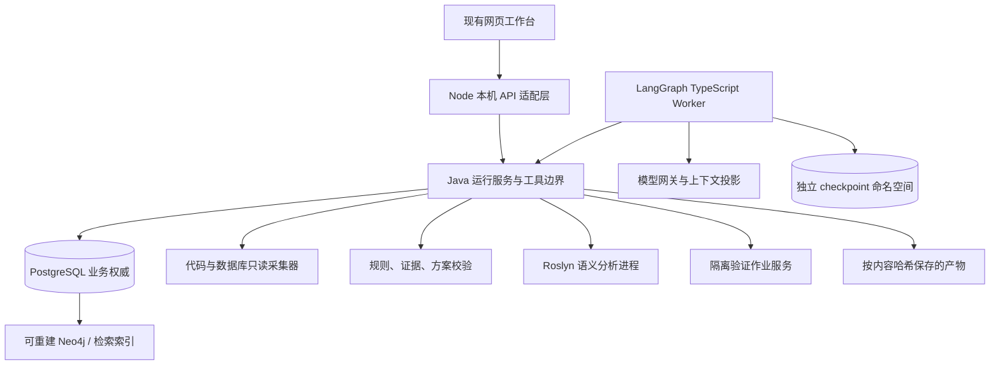

# ArchLens 自主迁移设计 Agent 详细设计 v2.0

文档日期：2026-09-29。文档性质：面向下一阶段的详细设计建议，供重新生成 spec 使用。本文版本号是设计文档版本，不是已发布产品或接口版本。


> 2026-09-30 文档整理补记：本文初稿的“本次”指两份设计资料创建阶段。随后已根据本文重建[当前 specs](../../ArchLensService/specs/implementation/requirements.md)，旧资料转入[历史归档](../archive/2026-09-29/README.md)。本次仅调整历史引用路径与本说明，设计内容及原核查、验证日期不变。

配套基线：[现有项目总结](ArchLens-现有项目总结-2026-09-29.md)。本文只描述目标设计、演进路径和验收要求；实际已实现能力以配套总结的源码核对及历史验证范围为准。本次仅新增 `docs/design` 下的两份 Markdown，不改旧规格、旧说明或产品代码。

本文的 **MD-Dxx** 是设计条目，**MD-ACxx** 是建议验收条目，均可映射到后续新 spec；不自动替换旧 INV 编号。标注“建议初值”的限额需要样例评测后定版；标注“拟议”的目录、接口、表和契约当前均不能直接调用。

## 1. 产品目标与完成含义（MD-D01）

### 1.1 产品目标

用户提供本地目录或代码仓库来源、按需业务数据库连接、目标环境及自然语言目的。系统在授权范围内自主完成现状调查、差异分析、方案比较、改造任务拆分和验证设计；在具备隔离环境时执行代表性验证，再根据证据修订方案。

支持的目标维度包括语言/平台迁移、数据库迁移、信创环境适配、系统重构及组件升级。多个维度可组合；“信创”不自动等同于转 Java，也不自动选择某数据库。不同项目可以具有不同源框架和不同迁移策略。

### 1.2 自主能力等级与交付边界

| 等级 | 系统可自主完成的工作 | 交付物 |
| --- | --- | --- |
| A0：现状调查 | 授权采集、静态分析、规则检查、未知项记录 | InvestigationReport、证据清单 |
| A1：迁移设计，首要建设目标 | 拆解问题、补查证据、比较备选、制定结构化方案、审查覆盖 | MigrationPlan、实施任务、验证计划、决策记录 |
| A2：设计验证，分阶段建设 | 在已登记的隔离环境生成并验证样例代码/DDL/SQL、依据结果修订方案 | 绑定方案和环境的 ValidationRecord |
| A3：实际迁移实施，独立后续范围 | 修改真实项目、业务数据搬迁、生产切换 | 本设计不以其作为完成条件，需单独的执行产品设计 |

“可自主完成”以指定范围和预先确定的验收要求为前提。业务取舍缺少输入时形成有针对性的澄清；没有目标实例或参考文档时保留未验证项，不能用模型确信程度代替证据。

### 1.3 首个端到端样例

选取小型 .NET 数据访问模块和 MySQL 测试库，明确一个接口/服务方法、涉及的 SQL/表对象、目标 Java 版本及目标数据库产品/版本/兼容模式。首期产出可追溯的设计草案；接入目标测试库并完成约定的代表性验证后，才验收 A2。

首例至少包含一个不兼容特征、一个证据缺口和一个需要保持的业务行为。KingbaseES 可作为首选目标候选，但具体版本和测试环境未确定前，不填写虚构版本，也不套用 PostgreSQL 规则发布兼容结论。

## 2. 输入模式与用户旅程（MD-D02）

### 2.1 三种分析模式

| 模式 | 必需输入 | 可选输入 | 覆盖边界 |
| --- | --- | --- | --- |
| CODE_ONLY | 代码来源、授权范围、目的 | 目标运行时/框架、离线数据库结构 | 可以设计代码改造；业务库实际配置和数据行为未知 |
| DATABASE_ONLY | 业务数据源或显式离线结构、目的 | 目标数据库测试环境、外部接口约定 | 可以设计库对象转换；应用访问影响未知 |
| JOINT | 代码来源、业务数据源、目的 | 目标环境、业务约束、验证环境 | 形成代码—SQL—对象的跨来源调查和组合设计 |

离线结构必须标记为用户提供、未在线核实。缺少某一来源不能伪装成联合分析已覆盖，也不强制用户为单项分析提供无关连接。

### 2.2 请求内容

- **来源**：本地目录或 Git 仓库引用、提交标识、包含/排除范围、可访问的数据库模式。
- **目的**：迁移/重构目标、保留/淘汰模块、希望比较的方案；允许同时包含多个目标维度。
- **环境**：数据库产品/版本/兼容模式/关键配置，语言、运行时、框架、操作系统、CPU、容器、中间件。
- **业务约束**：接口兼容、金额精度、事务一致性、停机窗口、可接受数据丢失量、性能目标、发布顺序。未知字段保留缺口。
- **运行策略**：模型配置引用、上下文使用策略、允许的工具、预算、仅分析或允许隔离验证。
- **验收范围**：必需覆盖的模块/对象/关键路径、验证类型、可接受的非阻塞未知项及其确认人。

连接密码与模型密钥采用独立凭据通道；可序列化的请求只保留不含秘密的授权引用。产品需要的技术版本可以由工具观测补齐，记录“用户声明”和“实际观测”两种来源；冲突时触发核对。

### 2.3 正常旅程

创建调查 → 校验输入和授权 → 固定来源 → 生成调查任务 → 展示已完成步骤和发现 → 必要时澄清 → 比较方案 → 生成实施/验证任务 → 执行允许的验证 → 修订并封存 → 下载结构化 JSON 和可读 Markdown。

补充答案、修改目标或扩大授权范围会创建新业务修订；查看历史、恢复进程故障和查询进度不会隐式修改原请求。

## 3. 技术决策（MD-D03）

| 决策 | 采用方案 | 理由与限制 |
| --- | --- | --- |
| ADR-01 编排 | 官方 LangGraph JavaScript/TypeScript，独立后端 worker | 项目已有 Node；适合有状态循环、暂停及恢复。依赖版本需原型验证后锁定 |
| ADR-02 模型接入 | 按需使用 LangChain 模型/工具组件，建立自己的 ModelGateway 边界 | 不依赖某一个供应商；已有 DeepSeek 可以保留为适配目标，但实际工具调用能力需测试 |
| ADR-03 分析核心 | 复用 Java 21 核心、采集器、规则和证据校验 | 框架不接管数据库事实、解析正确性或兼容规则 |
| ADR-04 .NET 语义 | 独立 .NET/Roslyn 分析进程，通过版本化协议接入 Java | 按项目、目标框架和编译条件绑定；F# 另设能力，不宣称 Roslyn 覆盖 |
| ADR-05 持久化 | PostgreSQL 为运行/证据/方案权威；LangGraph checkpoint 使用独立命名空间 | 编排游标不等于业务终态；需要恢复协调和幂等账本 |
| ADR-06 图与检索 | 权威证据可用 PG/文件产物保存，Neo4j 和向量索引均为可重建投影 | 首个设计闭环不依赖完整图数据库上线；向量相似不产生事实依赖 |
| ADR-07 Agent 数量 | 首期一个主规划 Agent，配专业工具和独立审查步骤 | 后续按独立任务并行；多个模型同意不构成验证 |
| ADR-08 部署 | 首期本机单用户，现有网页继续复用 | 不因框架接入同时迁移 Vue/Spring Boot；多用户服务另设身份和租户范围 |

LangGraph 官方将自身定位为有状态编排运行时，并允许混合确定性与模型步骤；不要求使用全部 LangChain。这里采用其编排能力，具体迁移知识和验收逻辑仍属于 ArchLens。参见[官方概览](https://docs.langchain.com/oss/javascript/langgraph/overview)。

LangChain4j/Spring AI 可作为未来全 Java 方案的替代评估项。本设计选择 TS 编排，不再同时引入另一套 Java Agent 框架。不得把模型供应商切换、源码外发或云端 trace 上传当作框架安装的默认副作用。

## 4. 目标架构与部署边界（MD-D04）



### 4.1 进程职责

| 组件 | 负责 | 不作为其输出保证 |
| --- | --- | --- |
| 网页与 Node API | 输入、状态、澄清、方案查看、只接收允许字段、客户端断线后的回读 | 不在 HTTP 请求生命周期内独占长任务 |
| Java 运行服务 | 创建修订、登记授权、发放 worker 租约、校验工具、保存证据、状态转换和封存 | 不把模型 JSON 直接当作事实或执行命令 |
| LangGraph worker | 问题规划、工具选择、设计、审查、根据结果补查 | 不直接写业务终态或更新已封存报告 |
| ModelGateway | 供应商适配、结构化输出、超时、用量、上下文策略 | 工具调用是否被允许仍由 Java 再校验 |
| 采集/解析进程 | 在授权范围产生可定位、可复查的观察结果 | 静态绑定不是运行时执行证明 |
| 隔离验证服务 | 在登记的测试环境执行受限作业并保存结果 | 样例通过不等于全系统迁移正确 |

### 4.2 拟议目录

```text
ArchLensClient/                         复用现有网页及本机 API
ArchLensService/
  src/main/java/io/archlens/
    agent/                             保留旧编排器供旧运行使用
    investigation/                     继续扩展已有采集与规则
    migration/                         新方案契约、验证、封存服务
    runtime/                           新任务租约、幂等账本、工具网关
  agent-runtime/                       新 TypeScript/LangGraph 后端 worker
    src/graph/  src/context/  src/model/ src/bridge/
  analyzers/dotnet/                     新 Roslyn 进程，按阶段落地
  validation/                          新隔离验证适配与测试夹具
docs/design/                           本次新增设计基线
```

以上新增目录只是未来位置建议，本次不创建实现骨架。Java 核心可先通过受控 JSON Lines 子进程协议调用，首期沿用项目现有进程适配方式；后续可抽为本机服务。无论进程形式如何，都不允许 TS 绕过 Java 的业务校验直接操作事实表。

### 4.3 运行环境

Java 保持现有 JDK 21/Maven 基线。新增 Node/TypeScript/LangGraph 版本应在原型阶段按包的 `engines`、支持周期和测试结果锁定，不能据现有 Node 18+ 说明推断新运行时兼容。CI 和交付物记录 lockfile、依赖清单和许可证。

## 5. 领域对象与版本化契约（MD-D05）

### 5.1 基本对象

| 对象 | 关键字段 | 语义 |
| --- | --- | --- |
| MigrationCase | caseId、objective、ownerScope | 一项迁移设计工作，可有多次不可变修订 |
| MigrationRequest | schemaVersion、analysisMode、sourceRefs、targetEnvironment、constraints、invariants、acceptanceScope、policyRefs、budget | 规范化并哈希后固定的输入；无凭据明文 |
| SourceSnapshot | snapshotId、sourceHashes、commitRef、dbFingerprint、collectorVersions、collectedAt、consistency、coverage | 多来源观察集合，明确时间和非原子边界 |
| Evidence | evidenceId、subjectId、sourceHash、location、granularity、producerVersion、observationType | 由工具生成；无法定位时说明粒度 |
| Finding | findingId、ruleRef、evidenceIds、outcome、conditions、unknownReasons | 规则结论，维持兼容/不兼容/有条件/未知 |
| Hypothesis | hypothesisId、claim、supportRefs、counterEvidenceRefs、verificationNeeded、status | 模型提出的推断或待验证判断，与事实独立 |
| InvestigationTask | taskId、goal、dependencies、capability、status、artifactRefs、budget、attempts | 可恢复调查/分析任务；不是交付给开发者的改造工单 |
| MigrationPlan | planId、version、scope、alternatives、selectedDesign、workItems、validationPlan、gaps、evidenceRefs | 可执行设计，不表示已应用变更 |
| ValidationRecord | validationId、planHash、snapshotHash、environmentHash、testSpecHash、status、resultRefs、executedBy | 说明哪个环境验证了哪个假设/行为 |
| DecisionRecord | decisionId、options、choice、reasonRefs、assumptions、decisionSource | 区分 Agent 建议与用户已确认的业务取舍 |

### 5.2 身份与引用

所有事实/方案引用必须绑定 runId、revision 和 snapshotId；跨运行复用通过显式导入记录及哈希核验。内容哈希使用确定的规范化 JSON；时间戳与内容哈希是否参与分别定义，禁止 TS 与 Java 各自采用不同的数字、空字段或排序规则。

源码身份同时包含项目/目标框架/编译条件；数据库对象身份包含数据源引用、目录、模式、对象类型及原始标识符。对象别名可以用于模型上下文，但必须跨查询稳定且可在本地映射回证据，不能匿名化后丢失关联。

候选依赖和语义绑定依赖分别存储。图边沿用 dependent → dependency；候选只能支持潜在影响，不能变成已确认的字段流或必须改造结论。

### 5.3 契约命名建议

新请求、方案、工具、事件分别使用 `archlens.migration-request.v1`、`archlens.migration-plan.v1`、`archlens.tool-envelope.v1`、`archlens.migration-event.v1`。这是新命名空间，不能覆盖现有 `archlens.agent.v2` 或调查报告 v1–v5。

Java/TS 的边界契约由同一 JSON Schema 生成或校验；自有对象拒绝未知属性、未知版本、非法枚举和跨快照引用。框架内部 checkpoint 另记录 graphVersion、stateSchemaVersion；它不是对外 API。

## 6. 来源采集和语义证据（MD-D06）

### 6.1 本地与 Git 来源

1. 本地来源先登记授权根目录及包含/排除策略；调查工具只通过来源引用读取，逐次复核真实路径、符号链接和数量预算。
2. 未来 Git 采集将选定引用解析为不可变 commit，拉入独立工作副本，记录子模块/LFS 是否纳入；不改变用户现有工作树。私有仓库凭据由宿主提供。
3. 不执行仓库 hooks、构建脚本或依赖安装来“发现项目”；无法解析的构建条件形成缺口。
4. 采集后复核来源哈希，发现漂移时使受影响结果失效。默认新建修订重新采集；已封存的历史报告保持原样。

### 6.2 .NET 平台

逐项目识别 .NET Framework、.NET Core、现代 .NET、.NET Standard，分别记录语言、SDK、TFM、框架和部署平台。C#、VB.NET 语义由 Roslyn 能力逐项接入，F# 暂保留声明盘点，直到独立适配器完成。

Roslyn 在明确引用程序集和编译条件下产生类型、方法签名、调用候选/绑定、属性和数据访问线索；缺少引用或条件不明时输出绑定覆盖。静态分析阶段不加载项目携带的 analyzer、source generator，也不运行 MSBuild/restore。若验证需真实构建，必须进入隔离验证阶段。Roslyn 的符号与语义接口依据见[官方编译器模型](https://learn.microsoft.com/en-us/dotnet/csharp/roslyn-sdk/compiler-api-model)。

框架适配按能力注册覆盖 ASP.NET MVC/Web API、ASP.NET Core、WCF、Web Forms、Windows 服务、WPF/WinForms；识别名称只表示发现该技术。数据访问适配分别处理 ADO.NET、EF6、EF Core、Dapper，逐步增加 SQL 参数、事务、实体映射和调用路径。

### 6.3 业务数据库

复用 MySQL、Oracle、KingbaseES、DM 连接与元数据入口；按厂商、版本和权限声明能力。先盘点结构，再按需要增加视图/过程/函数/包/触发器/序列/同义词定义及其引用；每种扩展需真实实例验证，不能由 JDBC 接口存在推定厂商支持一致。

对象定义采集采用固定、审阅过的系统目录查询，参数绑定模式和对象标识；模型不能传入任意 SQL。默认不读取业务行。用于数据规模、字符分布或数据清洗设计的统计与抽样属于单独可配置能力，未授权时仅列为后续验证任务。

权限可见性、对象定义缺失、TLS 未核验和多查询非原子性进入覆盖报告。记录实际产品/版本/兼容模式；声明冲突影响规则选择。MySQL 8.4 采集可用不能自动扩大现有 MySQL 8.0 迁移规则的适用版本。

### 6.4 跨来源证据

分级形成：入口声明 → 方法/服务 → 数据访问调用 → SQL/ORM 映射 → 表/列/程序对象。每一段单独记录绑定依据和确定程度；只存在同方法文本线索时保持候选。反射、跨库动态 SQL、复杂 ORM 和运行时配置保持缺口。

覆盖至少分开统计：已发现、纳入、采集、解析、符号绑定、对象绑定、规则检查、验证。分母来自已授权范围，不能用已成功解析数量做“全覆盖”分母。

## 7. 数据库方向与组合迁移策略（MD-D07）

### 7.1 能力模型

`SourceFeatureProfile` 描述源对象实际使用的能力；`TargetCapabilityProfile` 描述目标指定版本/模式/配置提供的能力；`MappingRule` 描述如何映射及前置条件；`PairExceptionRule` 保存特定源→目标的语义例外。规则支持方向明确，不能自动反转。

检查维度至少包括：数值精度/值域、时间及时区、字符串/空串/NULL、排序与大小写、JSON/LOB、生成键/序列、约束/索引、SQL 方言、过程语言、权限、驱动、分页、事务隔离/锁/重试以及导入导出与增量同步能力。

该模型可复用源采集与目标描述，不能消除厂商组合的专项规则和测试成本。不存在可无损通用转换的默认假设。

### 7.2 规则与知识来源

- 已发布规则含版本、适用源/目标范围、必要配置、证据前提、正反例和官方依据。
- 检索材料按产品版本、兼容模式、发布日期和文档哈希索引；来源链接和抓取时间保留。
- 检索结果和模型常识可以提出候选方案或待验证规则，不能即时写入正式规则目录。
- 候选规则经版本核对、样例验证、审阅与发布后成为可复用规则；缺官方说明或验证失败时保留 UNKNOWN。
- 历史项目方案只在来源、目标及约束适用时复用，沿用其原始验证范围，不扩大结论。

### 7.3 组合目标的协调

平台迁移、数据库替换、CPU/OS 和中间件适配各自产生工作项，由规划器合并共享改造与检测冲突。例如数据访问层框架、事务边界和数据库驱动的选择必须能共同成立。

对先迁语言、先迁数据库、分模块过渡等备选进行比较，说明接口兼容、并行运行、数据一致性、停机和回退代价。源数据量、写入频率或停机约束未知时，不能直接选定全量/增量/双写方案或估算精确工期。

## 8. 迁移方案契约与交付物（MD-D08）

### 8.1 MigrationPlan 必需内容

| 字段组 | 内容与要求 |
| --- | --- |
| identity | planId、schemaVersion、caseId、runId、revision、requestHash、snapshotHash、planHash |
| objectiveAndScope | 源/目标环境、范围、约束、不变量、验收要求及其来源 |
| currentArchitecture | 模块职责、应用/数据库依赖、关键路径和覆盖摘要 |
| alternatives | 可行候选、选择理由、限制、被排除方案及依据；候选不足时说明原因 |
| targetArchitecture | 组件、边界、接口、部署、数据访问、事务与目标环境的对应设计 |
| mappings | 平台/API/依赖/数据库对象的处置：保留、替换、重写、拆分、淘汰、待决 |
| workItems | 可分派的改造任务、前置条件、依赖、产物及完成标准 |
| validationPlan | 关联业务不变量/假设的验证项、环境、数据策略、预期判据 |
| rolloutAndRollback | 分批顺序、切换前检查、观测指标、回退触发/步骤与不可逆限制 |
| assumptionsAndGaps | 未确认输入、未覆盖对象、阻塞问题、需要业务方决定的取舍 |
| evidenceAndDecisions | 工具证据、规则版本、外部资料、模型推断、用户决策分别引用 |
| estimates | 有依据的工作量区间和估算假设；无法估算时为空并说明缺口 |

### 8.2 改造工作项

每个 `MigrationWorkItem` 至少有稳定 workItemId、标题、关联源对象、原因、目标变更说明、证据/假设引用、依赖任务、前置条件、预期产物、完成标准、验证项及优先级依据。任务依赖必须无环；真正互相耦合的改造合并为一个工作包或先设计解耦步骤。

区分“调查还需做什么”的 InvestigationTask 与“开发人员后续改什么”的 MigrationWorkItem。设计 Agent 完成前者，不自动把后者标为已实施。

以下为字段组合示意，不是已实现 API 或已验证转换规则：

```json
{
  "workItemId": "work-amount-contract",
  "sourceSubjectRefs": ["subject-amount-api", "subject-amount-column"],
  "reasonRefs": ["finding-precision", "hypothesis-rounding"],
  "changeDescription": "制定并实现源端与目标端一致的金额精度和舍入契约",
  "dependsOn": ["work-confirm-money-invariant"],
  "deliverables": ["类型映射决策", "接口契约", "边界用例"],
  "acceptanceCriteria": ["约定的金额边界用例在登记环境中通过"],
  "validationRefs": ["validation-money-boundary"],
  "decisionStatus": "PROPOSED"
}
```

### 8.3 导出与历史

权威产物为版本化 JSON，可读 Markdown 由同一结构生成，避免报告文字和任务字段不一致。导出包含引用清单、范围、未知项和验证覆盖；不带凭据、原始模型思考或未经授权的源码。未来 Word/PDF 可作为呈现适配器，不改变方案事实源。

封存前校验 Schema、引用存在性、依赖无环、范围完整性、约束冲突和验证覆盖。程序能验证结构及部分规则，不能据此声称整个自然语言设计语义已被证明。

## 9. LangGraph 调查与设计循环（MD-D09）

### 9.1 图节点

| 节点 | 输入 | 输出与路由 |
| --- | --- | --- |
| validate_request | 固定请求、授权、能力目录 | 输入合法则继续；缺必需信息进入澄清 |
| establish_baseline | 来源引用、已有来源证据 | snapshot 引用、实际技术画像和差异 |
| plan_investigation | 目的、基线、覆盖、现有任务 | 结构化调查任务 DAG，服务端校验范围与预算 |
| choose_next_task | 可执行任务、能力、预算 | 选择依赖已满足的任务；不能调用任意新工具 |
| collect_or_analyze | 已登记工具及参数 | 保存工具产物；更新任务、证据索引和覆盖 |
| assess_gaps | 新证据、约束、失败 | 补查、澄清或进入设计；连续无进展时停止扩展 |
| synthesize_design | 已验证引用、假设、规则/文档 | MigrationPlan 草案与备选理由 |
| review_design | 草案、验收范围 | 结构检查与独立模型审查意见；不改变原始事实 |
| validate_design | 约定验证项、可用环境 | 静态或隔离验证记录；失败返回调查/设计节点 |
| evaluate_completion | 方案、覆盖、阻塞项、验证记录 | 由代码决定能否封存或需 PARTIAL/NEEDS_INPUT |
| request_seal | 计划引用、运行票据 | Java 原子核验并封存，返回权威回执 |

主 Agent 可以在允许节点之间提出下一步建议；节点可执行性、证据可用性、预算和完成判据由程序检查。计划可动态增加问题，但扩展来源、工具权限或执行模式只能通过新的授权策略/修订。

### 9.2 编排状态

LangGraph State 只保存固定请求/快照引用、调查任务、问题、假设、方案/验证产物引用、预算计数、最近事件游标和压缩后的工作摘要。大段源码、凭据和数据库连接对象不写入图状态。

长上下文按任务取证据，已完成工作用带引用的摘要压缩；摘要不能成为新的事实来源。重要业务决策进入 DecisionRecord，不能只存在对话窗口。单次消息裁剪必须保留该任务的约束、反证和未决问题。

### 9.3 调查任务与无进展判据

任务状态为 PLANNED、READY、RUNNING、SUCCEEDED、BLOCKED、FAILED、SKIPPED。SKIPPED 必须有原因，并进入覆盖缺口，不能算完成。依赖对象用稳定 ID 关联，任务变更留存 planVersion。

同一工具、同一规范化参数和同一来源哈希的重复调用优先复用产物。连续两轮未新增证据、任务状态或可操作验证反馈，视为无进展的建议初值；返回 PARTIAL 并说明未解决问题，或在确需用户输入时暂停。不能靠把调用上限不断调大来延长无效循环。

### 9.4 澄清及独立审查

澄清问题说明缺失字段、为何影响设计、阻塞哪些任务，并提供合理可选项。已能从工具观测的技术事实先尝试采集；预算、停机容忍度和业务取舍不能由模型编造。

审查步骤使用独立上下文检查约束遗漏、引用不足、任务冲突、目标组合矛盾和验证空白。审查可以产生反例及补查建议，不能通过模型投票把假设提升为事实。

## 10. 运行状态、检查点与恢复（MD-D10）

### 10.1 状态分离

| 维度 | 拟议状态 | 判定者与含义 |
| --- | --- | --- |
| 运行 executionState | QUEUED、RUNNING、NEEDS_INPUT、WAITING_EXTERNAL、COMPLETED、PARTIAL、FAILED、CANCELLED、SUPERSEDED | Java/PG 权威；图节点结束不能直接改变终态 |
| 设计 designStatus | DRAFT、BLOCKED、READY_FOR_REVIEW、ACCEPTED_FOR_SCOPE、SUPERSEDED | READY 表示满足自动门槛；ACCEPTED 需记录范围与确认主体 |
| 验证 validationStatus | NOT_RUN、RUNNING、PASSED_FOR_SCOPE、FAILED、INCONCLUSIVE | 由测试服务结果及覆盖规则决定 |
| 规则 outcome | COMPATIBLE、INCOMPATIBLE、CONDITIONAL、UNKNOWN | 由适用规则与证据决定，与运行是否完成独立 |

COMPLETED 表示本次约定的设计交付任务完成；不能显示为“迁移成功”。请求要求 A2 验证而缺少环境时不得 COMPLETED；若请求只要求 A1，验证计划完整但尚未执行可 READY_FOR_REVIEW，需显著显示 NOT_RUN。阻塞项存在时设计状态为 BLOCKED，运行可以先保存 PARTIAL 草案。

主要转换由业务服务执行：QUEUED → RUNNING；RUNNING → NEEDS_INPUT / WAITING_EXTERNAL / 任一终态；WAITING_EXTERNAL 在作业可消费后回到 QUEUED；可恢复的执行故障在重新领取租约后继续同一 run。NEEDS_INPUT 收到有效答案时旧 run 转 SUPERSEDED，下一修订进入 QUEUED。COMPLETED、PARTIAL、FAILED、CANCELLED 和 SUPERSEDED 均为该 run 的终态；终态后追加输入/重试通过新修订，不原地复活。进程失联本身不是立即 FAILED，只有确认不可恢复或恢复预算耗尽才进入该终态。

### 10.2 身份及单一调度所有者

新运行由 caseId、runId、revision、requestHash 标识；拥有 workerId、leaseUntil 和单调递增 epoch。同一 run 只有一个有效 worker。工具执行与封存须同时校验状态、修订、epoch、租约和输入哈希。

新运行与旧 Agent 调查分属独立生命周期。迁移期间可以选择 LEGACY 或 LANGGRAPH，但一次 run 的选择固定，不能由两套循环共同控制。

### 10.3 新持久表和旧存储关系

| 新增逻辑表（拟议） | 关键内容 |
| --- | --- |
| migration_case / migration_run | 最新修订、固定请求、执行状态、编排类型、租约/epoch、完成回执 |
| migration_task | 调查任务 DAG、状态、尝试次数和产物引用 |
| tool_invocation | 稳定调用身份、输入/快照哈希、执行状态、结果引用和去重约束 |
| migration_artifact | 证据索引、假设、方案、验证结果、内容哈希、不可变版本 |
| migration_event | 有序事件、摘要、游标、所属修订 |
| migration_question / migration_answer | 问题版本、父产物哈希、回答与消费状态 |
| validation_job | 隔离作业身份、授权、环境、状态和产物 |
| checkpoint_link | 当前运行认可的 checkpoint 引用、命名空间、graphVersion、epoch、状态哈希 |

以上通过追加迁移创建，不修改既有迁移文件校验和。初期不将新状态写入旧 `investigation_run`；通过显式 `legacyRunRef` 导入旧报告，保留原哈希与状态。新 migration_case 有自己的修订序列，不更新旧 investigation_case 的 latest_revision。

LangGraph 自己管理的 checkpoint 表置于独立 schema/权限下，不复用旧 checkpoint_json 字段。数据库部署可以共用同一 PostgreSQL 实例；表逻辑、写入所有权和保留策略分别定义。

### 10.4 租约和暂停

运行领取、续租、暂停、取消和封存通过 Java 运行服务。建议原型租约 180 秒、续租间隔不超过 30 秒；这是新 worker 协议的建议初值，现有 180 秒租约没有自动成为长任务续租能力。

NEEDS_INPUT 和 WAITING_EXTERNAL 保存检查点后释放执行租约。进程崩溃由恢复调度重新领取；取消立即增加 epoch 并禁止后续发布。模型请求可能无法瞬时撤回，但返回值不能再写入有效业务状态。

进入暂停状态时同时使旧执行票据失效。WAITING_EXTERNAL 期间，验证服务使用独立作业身份写入 validation_job 和不可变结果产物，不持有修改 MigrationRun/Plan 的权限。结果事件只唤醒调度；调度重新领取新 epoch、核对当前修订后消费结果。若已取消/取代，则结果留作历史，不推进方案。

澄清回答提交包含 questionSetHash、parentArtifactHash 和 expectedRevision。答案消费与分配下一修订在同一事务完成；旧 run 变为 SUPERSEDED，新 run 使用新请求哈希。重复提交按幂等键返回同一结果，冲突答案拒绝。这是业务修订流程，不直接把浏览器答案传给框架 `Command`。

新修订从 validate_request 节点和新的 thread_id 启动。可显式导入仍适用的来源/工具产物和任务结果，但须重新核验哈希、权限、目标条件、能力版本，保留导入依据并重新规划。不得对旧 run 的 interrupt 执行 `Command(resume)` 后替换其中的请求身份。框架同 thread 的 resume 只用于同一固定输入运行的受控暂停/故障恢复。

### 10.5 检查点隔离与恢复算法

1. Java 原子领取运行，核对最新修订、状态和租约，增加 epoch；返回宿主票据。
2. 恢复器读取 PG 认可的 checkpoint_link，核验 graphVersion、stateSchemaVersion、请求/来源哈希及产物引用；无法兼容的检查点不直接反序列化运行。
3. `thread_id` 使用 runId；checkpoint 命名空间增加 graphVersion 和 epoch。同一 epoch 内保持稳定，新 worker 从已核验状态恢复到新命名空间。
4. 旧 worker 即使迟到写入旧命名空间，也不能推进 checkpoint_link。认可指针更新使用 PG 条件写入，同时校验新 epoch、租约、预期旧指针和单调递增的 checkpointSequence/事件游标；同 epoch 的乱序回调也不能使认可进度倒退。并行子任务的检查点由主图协调汇合，不各自覆盖主运行指针。
5. 业务服务先持久化工具结果/任务事件，再允许图推进；只有通过认可的检查点用于下一次恢复。
6. 恢复先对账已完成工具调用和外部验证作业，再继续模型循环。源码、规则、目标或模型策略不再适用时使相关结果失效，必要时创建新修订。

新 epoch 命名空间的状态导入由适配层实现，需在锁定的 LangGraph 版本上实测；不能假设简单更换 thread_id 就会继承旧状态。框架默认 checkpointer 不负责 ArchLens 的 epoch 隔离，这部分必须明确实现。

框架中断恢复可能重新执行中断节点开头的代码，因此中断节点应只读取或调用可重放的幂等操作。[LangGraph 中断文档](https://docs.langchain.com/oss/javascript/langgraph/interrupts)明确了此行为。

### 10.6 幂等与崩溃窗口

工具调用使用宿主生成的 invocationId，去重同时绑定 runId、任务版本、工具版本、规范化输入哈希和 snapshotHash。epoch 不属于重复操作身份，避免领取新租约后重复创建同一验证作业。模型不能自行挑选幂等键。

| 故障窗口 | 恢复行为 |
| --- | --- |
| 调用登记成功、工具尚未开始 | 按同一 invocationId 继续 |
| 工具完成且产物保存、图检查点未推进 | 回读已有结果，推进图，不再次封存/创建作业 |
| 外部验证启动后宿主崩溃 | 通过 validationJobId 查询状态，避免再次启动 |
| 检查点有推进、业务结果未认可 | 以业务账本为准对账，不使用缺失或未认可引用 |
| 取消/新修订后旧结果返回 | 标记迟到/隔离，拒绝业务写入 |
| 模型返回后保存失败 | 可按原预算重试并记录不确定调用成本；不声称模型调用恰好一次 |

框架 checkpoint 与业务封存无需跨系统分布式事务；通过先保存产物、后认可游标、按账本对账保证可恢复。幂等可以防止重复业务提交，不能保证供应商调用没有重复计费。

## 11. 工具注册、桥接协议与错误处理（MD-D11）

### 11.1 工具能力目录

| 工具类别 | 拟议工具 | 主要约束 |
| --- | --- | --- |
| 范围内发现 | discover_projects、list_authorized_sources | 只能使用已登记 sourceRef，不能自行扩大目录/仓库 |
| 语义读取 | query_symbols、query_dependencies、read_evidence | 绑定快照；分页、限量；候选和绑定分开 |
| 数据库观察 | collect_database_metadata、read_object_definition | 凭据由本地引用解析；固定只读查询与对象范围 |
| 知识研究 | search_versioned_docs、read_rule_basis | 版本/来源可追溯；内容只作数据，不改变权限 |
| 确定性分析 | list_capabilities、run_rules、analyze_impact | 检查适用版本与已存在证据，不接受模型生成图边 |
| 方案操作 | propose_plan、review_plan、check_plan_constraints | 写方案草稿和审查意见，不能修改事实 |
| 隔离验证 | submit_validation_job、get_validation_result | 专门的执行授权、注册环境和作业模板 |
| 澄清与完成 | propose_questions、evaluate_completion、request_seal | 问题和终态由业务服务校验 |

Manifest 包含 toolId/version、输入/输出 Schema、支持技术范围、所需权限、读取/写入类别、资源上限、超时、重试及幂等语义。模型看到的是业务参数和能力说明，宿主补充票据、scope 和凭据引用。

### 11.2 桥接信封

TS→Java 宿主信封包含 protocolVersion、requestId、runId、revision、epoch、invocationId、snapshotHash、toolId、toolVersion、arguments、budget 和 capabilityRef。敏感票据不进入 prompt。Java 校验来源和运行状态后返回 status、artifactRefs、diagnostics、coverageDelta、retryability、elapsedMillis。

JSON Lines 固定 UTF-8，单条大小上限、超时、独立进程退出码及结构错误码必须定义。进程参数使用数组，不拼接 shell。日志写独立通道；标准输出只能包含协议数据。大产物通过受控 artifactRef 读取，不直接返回机器任意文件路径。

### 11.3 失败行为

| 类型 | 行为 |
| --- | --- |
| 模型不可用/格式不合法 | 有限重试；保留已采集事实；无法生成完整方案时 PARTIAL，明确模型未完成 |
| 来源/版本/能力不支持 | UNKNOWN/覆盖缺口，继续独立任务或提出必要澄清 |
| 身份过期、取消、授权不足 | 不重试越权操作；停止受影响任务 |
| 网络临时失败 | 限次退避，计入总预算；数据库登录失败不反复尝试密码 |
| 规则与证据冲突 | 记录冲突和双方引用，补查或阻塞结论 |
| 验证失败 | 保存实际错误与反例，进入方案修订；不能丢弃失败记录 |
| 存储失败 | 禁止发布成功回执；保留可恢复临时产物并返回失败 |

## 12. 模型上下文与数据策略（MD-D12）

当前通道只发送匿名摘要。下一代需要新的、可审计的数据策略，不能直接把完整 InvestigationReport 或业务连接序列化给模型。

| 策略 | 可发送内容 | 适用能力 |
| --- | --- | --- |
| SUMMARY_ONLY | 用户目的、技术声明、匿名规则摘要、数量与缺口 | 兼容现有边界，完整业务设计能力有限 |
| SCOPED_SEMANTICS | 结构化符号/关系/对象特征、稳定别名、必要语义属性 | 适用于结构驱动的设计；不可推导未见方法实现 |
| SCOPED_SNIPPETS | 在上述基础上发送明确范围、长度受限并检查敏感信息的代码/对象定义片段 | 需要理解实现语义的设计任务 |

模型部署位置单独配置为本地/私有或外部供应商。选择本地模型也不解除文件和数据库范围控制。每次请求保存投影策略版本、证据引用及内容哈希；实际发送内容按本地保留策略记录，访问受控。

密码、令牌、连接串、密钥文件、业务行和日志中的敏感值不进入上下文；对象定义和源码可能包含秘密，需要检测与脱敏。无法安全表达且确实影响结论时形成缺口，不能“删掉敏感内容后当作完整证据”。用户自由文本进入模型前也给出用途提示并执行必要过滤。

外部文档、源码注释、数据库注释和工具结果均为不可信内容，不允许改变系统策略、选择新的工具端点或覆盖已声明目标。检索缓存绑定来源与版本，防止把旧资料或其他项目的上下文混入当前方案。

LangSmith/其他云端 trace 默认不启用；本机事件与脱敏追踪满足首期调试。未来启用时独立声明发送范围和保留策略。

## 13. 验证服务与设计完成门槛（MD-D13）

### 13.1 三层验证

| 层次 | 验证内容 | 证明范围 |
| --- | --- | --- |
| V1 结构与证据 | Schema、引用、版本匹配、任务无环、范围与约束覆盖 | 方案结构可用且有依据，不证明业务等价 |
| V2 静态设计检查 | 类型映射条件、接口约定、SQL/依赖/配置冲突、目标能力 | 只证明已实现检查项 |
| V3 隔离行为验证 | 编译、代表性 SQL/DDL、接口契约、差异测试、事务/精度边界 | 指定样本、代码和环境中的实际结果 |

每个关键假设/业务不变量关联至少一个验证项或明确的外部确认。人工导入测试结果标记 EXTERNAL_UNVERIFIED，除非系统能核实其产物与环境绑定；不能自动冒充本机执行。

### 13.2 隔离执行边界

静态调查继续保持只读。V3 使用独立环境，输入为内容寻址的样例/补丁/测试定义，配 CPU、内存、时间、磁盘、网络和作业数量限制。构建/依赖恢复及源生成器只在该执行模式中受控运行，凭据与业务源环境隔离。

数据库验证使用专门测试实例及测试账号；可按登记模板创建/清理临时对象。禁止把业务源只读连接当作验证连接，禁止在业务源执行模型生成 SQL。来源数据默认合成；脱敏样本和业务统计需单独的范围策略。

验证结果保存执行命令模板、工具/镜像/驱动版本、环境哈希、输入哈希、退出码、断言结果及受控日志引用。清理失败作为作业状态记录并限制后续资源分配。

### 13.3 完成门槛

evaluate_completion 必须同时检查：约定必需来源可用；必需模块/对象均有处置；关键约束有对应决策；必需工作项具备前置条件/完成标准/验证项；不存在未解决的阻塞冲突；要求执行的验证已取得有效记录；预算及来源仍有效。

“有效记录”同时要求匹配最终 planHash、snapshotHash、environmentHash 和测试规范，且每个必需验证项的全部必需断言通过。FAILED、INCONCLUSIVE、NOT_RUN 或旧方案的 PASSED 均不能满足必需执行项。修订方案后必须重新运行受影响的验证；经确定性依赖核验可复用的结果须保存显式重绑定记录，不能仅改写原记录的 planHash。只有 A1 验收范围本就不要求执行的验证，才允许以完整验证计划和明确 NOT_RUN 完成设计交付。

非阻塞未知项可保留，但须说明影响范围和后续处理；验收范围外内容显式排除。模型的 finish 建议只能触发此检查，不能自行赋值 COMPLETED 或 PASSED_FOR_SCOPE。

## 14. 对外接口及事件（MD-D14）

本节为拟议接口，使用新前缀；现有 `/api/investigations` 保留原有行为。初期仍仅服务本机单用户，禁止将本机无生产鉴权接口直接公开。

| 方法与路径 | 用途 | 关键语义 |
| --- | --- | --- |
| POST /api/migrations | 校验、创建 Case/Run 并入队 | 请求幂等键；202 返回 caseId/runId/revision，不等待分析结束 |
| GET /api/migrations/{runId} | 查询权威状态 | 返回执行、设计、验证三个维度及预算/缺口摘要 |
| GET /api/migrations/{runId}/tasks | 查看调查任务和进度 | 分页，包含未完成和被跳过原因 |
| GET /api/migrations/{runId}/events | 事件流或按游标回读 | 有序 eventId，可断线重连；终态由 PG 确认 |
| GET /api/migrations/{runId}/questions | 查询当前问题 | questionSetHash、父产物哈希及对应阻塞范围 |
| POST /api/migrations/{runId}/answers | 补充业务/技术答案 | 绑定父哈希、expectedRevision；创建新修订 |
| POST /api/migrations/{runId}/cancel | 取消 | 原子增加 epoch；重复取消返回一致结果 |
| POST /api/migrations/{runId}/retry | 请求故障恢复或重新运行 | 可恢复故障领取同 run；终态失败/输入变化创建新修订，并明确返回类型 |
| GET /api/migrations/{runId}/plan | 读取当前或封存方案 | 指定 planVersion，包含 planHash 和 draft/sealed 标记 |
| GET /api/migrations/{runId}/artifacts/{artifactId} | 读取被授权产物 | 校验所属范围，禁止任意磁盘路径 |
| POST /api/migrations/{runId}/validation-jobs | 提交已定义验证项 | 校验执行授权与测试环境；稳定作业去重键 |
| POST /api/migrations/{runId}/decisions | 记录方案取舍或范围验收 | 绑定 planHash；改变设计输入时创建新修订 |
| GET /api/migrations/{runId}/export | 导出 JSON/Markdown | 只导出授权内容；保留原始封存哈希 |

运行资源统一错误结构：code、message、retryable、correlationId、relatedRefs。不回显完整驱动异常、供应商响应或秘密。旧/新接口状态明确映射，不把新 COMPLETED 倒写为旧 Agent 具有相同保证。

凭据绑定使用独立本机后端接口和不含密码的 credentialRef；引用按范围和时效校验。重启后凭据未恢复则请求重新绑定，不能将密码放进 checkpoint。单纯密码轮换且数据源身份不变不改变业务修订，端点/账号/模式/策略变更需要重新核对来源并创建修订。

事件建议包括 RUN_CREATED、TASK_STARTED、EVIDENCE_ADDED、QUESTION_RAISED、PLAN_REVISED、VALIDATION_FINISHED、RUN_SEALED、RUN_CANCELLED。事件只含受控摘要和引用，不发送隐藏思考；前端通过游标回读不丢进度，也不自行推断完成百分比。

## 15. 工作台呈现与用户交互（MD-D15）

保留现有原生页面，以功能面板扩展。输入先选 CODE_ONLY / DATABASE_ONLY / JOINT，再呈现对应必填项；源、目标产品和版本相互独立，缺少目标信息时允许现状盘点。

| 面板 | 主要内容 |
| --- | --- |
| 来源与环境 | 授权来源、快照、实际/声明版本差异、目标配置和模型数据策略 |
| 调查进度 | 当前阶段、任务完成/阻塞、预算、最后活动、取消和恢复入口 |
| 现状与证据 | .NET 工程、数据库结构、依赖路径、候选标记、来源定位与覆盖 |
| 方案比较 | 候选方案、约束符合情况、取舍、假设和目标架构 |
| 改造任务 | 按模块/阶段展示工作项、前置依赖、产物与验收项 |
| 验证与决策 | 已运行/未运行、成功/失败/不确定、环境、反例及业务待决项 |
| 历史与导出 | 修订差异、何种输入变化触发重算、不可变报告和引用 |

用户补充答案后显示新修订，历史视图保持只读。模型不可用时显示确定性结果及缺失的设计能力；图/方案存在不代表已验证。设计草案和封存版本须有明确标识。

输入校验、中文错误信息、键盘操作、桌面/窄屏布局及断线恢复均属于前端验收。第一阶段只新增完成闭环所需面板，不把框架内部 checkpoint、epoch 或工具协议字段暴露为业务输入。

## 16. 预算、性能、可观测性与运维（MD-D16）

### 16.1 有界执行

预算包含模型调用/输入输出 token、工具次数、墙钟时间、单次超时、并发数、采集文件/字节/对象数、验证作业资源和重试次数。使用共享预算账本在派发前预留，在回执后结算；并行节点不能分别耗尽同一份额度。

以下只作为小型本机原型的建议初值，并非当前实现或性能保证：单个设计运行 20 分钟、最多 32 次模型调用/64 次工具调用、同时 1 个模型任务和 2 个只读工具任务、1 个隔离验证作业。token/费用上限由选定模型及用户配置给出，未知时以 token 上限控制，不填虚构价格。

旧采集器限额继续生效直到对应扩展完成；超出范围明确返回截断/失败，不能仅增加外层预算绕过内部边界。预算耗尽保存 PARTIAL 及下一步，不能伪称设计完成。

### 16.2 缓存与变更失效

缓存键至少包含来源内容哈希、采集/解析器版本、规则版本、目标条件和投影策略；模型产物还绑定模型配置、提示模板与已用证据。数据库观察缓存需同时满足可见权限及快照条件，不能仅按库名命中。

代码、目标版本、数据库结构或业务约束变化时，沿引用关系标记受影响方案/验证失效。已封存旧记录保留，新修订重算；旧测试通过不能自动沿用到新 planHash。

### 16.3 日志与观测

记录 correlationId、run/revision、工具/节点名、参数和产物哈希、耗时、预算、错误码和状态转换。质量指标包括证据有效引用率、无依据结论数、关键路径覆盖、未知项暴露、验证失败后的修订表现、人工纠正率、恢复成功率、成本与时延。

隐藏思考不作为日志或审计产物。源码片段和完整 prompt 的本地诊断保留需受数据策略控制，不能随默认日志输出。框架 trace 与产品事件可关联，但 trace 系统故障不能让业务运行错误地成功或丢失已封存产物。

### 16.4 部署、保留与恢复

本机由启动入口管理 Node API、worker 和必要 Java 进程；浏览器关闭不取消已经入队的设计运行。worker 重启通过 PG 领取恢复，不依赖内存队列。产物目录采用服务生成路径和哈希，限制配额。

数据库备份覆盖业务状态和检查点，产物备份包含引用校验；恢复测试要验证记录与文件一致。临时验证环境、checkpoint、诊断日志与封存报告分别制定保留策略；垃圾回收不能删除仍被封存方案引用的证据。

多用户/远程部署在后续 spec 单独定义身份、租户隔离、授权、凭据存储和配额，完成前维持本机部署边界。

## 17. 与现有项目的演进关系（MD-D17）

### 17.1 复用、扩展和替换

| 当前模块 | 演进方式 |
| --- | --- |
| InvestigationEngine、rules、parser、analysis | 复用已有真实能力，增加独立契约的语义工具及来源版本；不把有限规则外推为通用转换 |
| DotnetInventoryAnalyzer | 继续负责声明盘点，叠加 Roslyn 语义产物，分别报告覆盖 |
| MysqlCollector / JdbcMetadataCollector | 保持源采集，按版本增加对象定义、配置与厂商实例测试 |
| CodeDatabaseAssociation / CodeAccessPathAnalyzer | 保留候选结果；新增绑定器逐段提高证据等级，旧候选不原地升级 |
| AgentOrchestrator | 旧接口继续使用；新 MigrationRun 由 LangGraph 编排，避免嵌套两套模型循环 |
| AgentModel / DeepSeekAgentModel | 旧运行保留；新模型网关提供统一适配，不依赖原类的固定提示流程 |
| AgentTools | 抽取稳定业务工具契约；六个旧工具保持旧输入输出，新目录使用独立协议 |
| PgInvestigationStore | 保留旧回读/封存及哈希；新增 migration 运行服务和表，复用校验原则 |
| Neo4jProjection | 继续保持可重建投影；新边类型必须有真实产物与 Schema 才能加入 |
| Node investigations.mjs 与现有网页 | 旧路由不变，新建 migration 路由与面板，明确草案/运行类型 |

现有代码位置和边界详见[项目总结](ArchLens-现有项目总结-2026-09-29.md)。已有本地未提交功能不是本次文档修改产生的代码，后续实施前必须保留并核对。

### 17.2 兼容与发布

旧 Agent v1/v2、调查报告 v1–v5 和其原始 canonical hash 按原样读取，不为新增字段重写历史 JSON。新旧代码均不能修改旧数据库迁移文件校验和。旧报告导入新 Case 时留下 sourceReportHash 和能力限制。

新编排按运行配置开关启用，先用合成样例验证。关闭新编排后旧分析和历史查询仍可使用；已创建的新运行要么由匹配版本恢复，要么明确停止/新建修订，不能交给旧编排器盲目接续。

新增依赖在锁定版本后验证构建、许可证和部署影响；不通过升级整个技术栈来掩盖接口不匹配。TS/Java 协议有契约回归样例，保持未知字段/状态的显式失败。

## 18. 实施阶段与可交付结果（MD-D18）

| 阶段 | 内容 | 出口条件 | 依赖 |
| --- | --- | --- | --- |
| P0 契约与框架原型 | 定义 MigrationRequest/Plan、工具协议、能力目录、PG 状态和 LangGraph checkpoint 适配 | 一个工具的实际调用、崩溃恢复、取消和幂等封存演示；未完成阶段不得声称具备自主迁移设计 | 当前代码基线 |
| P1 设计草案闭环 | 主 Agent 调查任务、受控语义上下文、方案草案、缺口审查和工作台基本展示 | 使用现有 .NET/MySQL 样例生成有对象依据的结构化草案；只具候选证据的路径明确标注 | P0 |
| P2 语义与方向规则 | 小范围 Roslyn 绑定、数据访问适配、源/目标能力与首个数据库方向规则 | 指定模块的一条真实语义链和正反例通过；与数据库采集支持分开公布 | P1 |
| P3 隔离验证闭环 | 登记测试环境、样例代码/SQL/DDL 验证、反例回流和方案修订 | 首例约定关键路径有真实验证记录；失败能够引起修订，缺环境不伪报完成 | P2、目标测试实例 |
| P4 扩展与运行质量 | Oracle/KingbaseES/DM 厂商实库、更多 .NET 框架、Git 来源、增量、多任务恢复和评测 | 每个新增方向及能力独立验收；中断/来源漂移/预算/旧报告回归通过 | P3 |

数据仓库/全量业务数据迁移、自动修改生产系统、公开多租户部署不计入上述首期里程碑。是否开展这些能力，由后续独立需求确定。

每阶段同时交付源码注释、契约样例、支持矩阵、失败行为和验证记录。仅添加枚举、空工具或模拟成功响应不算阶段交付。

## 19. 建议验收清单（MD-D19）

下表供新 spec 转为可执行测试及人工验收任务。本文没有运行这些新能力的测试。

| 编号 | 场景 | 必须观察到的结果 |
| --- | --- | --- |
| MD-AC01 | 三种输入模式 | 单项模式无需无关来源；联合模式缺来源明确报错或由用户修改范围 |
| MD-AC02 | 同一解决方案含 Framework/Core/现代 .NET | 逐项目记录 TFM/语言，不合并为一个虚构版本 |
| MD-AC03 | 仅识别项目声明、缺引用程序集 | 绑定覆盖不足明确显示，不生成确认调用链 |
| MD-AC04 | 数据库账号不可见对象、权限不足 | 可见性限制进入报告，不宣称不存在该对象 |
| MD-AC05 | 已支持采集的版本没有迁移规则 | 采集成功但兼容性 UNKNOWN，不能自动套最近版本 |
| MD-AC06 | 源→目标规则反向使用或兼容模式不符 | 拒绝匹配；反向规则需要独立案例 |
| MD-AC07 | 代码和库对象名称相同但存在歧义 | 保持候选/歧义；模型不能直接提升为绑定 |
| MD-AC08 | 构造缺口及有用补查工具 | Agent 选择能补齐缺口的工具；记录新证据及决策依据 |
| MD-AC09 | 无效工具、越界路径、任意 SQL、伪造票据 | Java 边界拒绝；源代码注释中的指令不能改变权限 |
| MD-AC10 | SUMMARY_ONLY 与 SCOPED_SNIPPETS | 外发内容符合所选策略；秘密哨兵不出现在模型/日志/产物 |
| MD-AC11 | 生成含不存在证据或跨快照引用的方案 | 结构/引用校验失败，不封存为完整设计 |
| MD-AC12 | 改造任务有环、无前置条件或无验证项 | 指出具体阻塞项；未达门槛不 COMPLETED |
| MD-AC13 | 组合目标产生框架/驱动/事务冲突 | 形成可定位冲突和备选/澄清，不各自输出相互矛盾的建议 |
| MD-AC14 | 必需业务约束缺失 | 生成针对性澄清；答案绑定父哈希和修订 |
| MD-AC15 | 同一澄清重复/并发提交 | 最多创建一个下一修订；冲突答案返回稳定错误；新 run 从新请求启动，旧 interrupt 不能被继续消费 |
| MD-AC16 | 工具结果持久后、checkpoint 前崩溃 | 恢复复用产物，不重复封存或重复创建验证作业 |
| MD-AC17 | 外部验证启动后回执丢失或运行已暂停 | 按作业 ID 回查，不重复作业；结果先存作业表，新租约核验后消费，取消后不推进方案 |
| MD-AC18 | 旧 worker 返回或 checkpoint 回调乱序 | 旧 namespace/epoch 不能发布；同 epoch 的认可指针 CAS/序号阻止倒退 |
| MD-AC19 | 暂停期间源码/数据库结构/目标变化 | 受影响产物失效，新修订重查；旧报告保留 |
| MD-AC20 | graph/stateSchema 不兼容 | 拒绝盲目恢复，走明确迁移适配或重新运行 |
| MD-AC21 | 模型缺失、超时、无进展、预算耗尽 | 保存确定性结果/草案与原因，PARTIAL，不伪造模型闭环 |
| MD-AC22 | 代表性精度、时间、空值、事务用例 | 保存断言与环境；失败触发修订；必需失败/不确定/旧方案通过记录都不能满足最终完成门槛 |
| MD-AC23 | 无目标实例但要求 A2 | NOT_RUN/阻塞状态明确，不能以静态审查代替执行通过 |
| MD-AC24 | 用户仅要求 A1 | 可交付 READY_FOR_REVIEW 及完整验证计划，明确哪些验证未执行 |
| MD-AC25 | 旧报告、旧 CLI 和旧接口回读 | 兼容原版本和哈希，不被新表/字段破坏 |
| MD-AC26 | 网页断线、worker 重启 | 回读任务和事件，能恢复指定运行，不显示虚假百分比 |
| MD-AC27 | 导出方案与页面内容 | JSON、Markdown、页面状态和引用一致，不含凭据 |
| MD-AC28 | 删除临时产物/恢复备份 | 仍被封存方案引用的证据可读取且哈希匹配 |

样例评测同时记录遗漏、误报、无依据建议、人工修改量、时延和模型消耗。样例包含代码单项、数据库单项、联合模式，以及正例、反例、证据不充分和工具故障。不能只用“报告生成成功”作为质量指标。

## 20. 重建 spec 的映射建议（MD-D20）

| 新 spec 主题 | 设计依据 | 验收依据 |
| --- | --- | --- |
| 产品范围、用户旅程和三模式 | MD-D01–02 | AC01、AC14、AC23–24 |
| 架构、框架接入、进程边界 | MD-D03–04、MD-D17 | AC09、AC16–20、AC25 |
| 输入、证据、快照与契约 | MD-D05–06 | AC02–07、AC11、AC19 |
| 数据库方向、组合目标与知识 | MD-D07 | AC05–06、AC13、AC22 |
| 方案产物及业务任务 | MD-D08 | AC11–13、AC24、AC27 |
| 调查规划、澄清和完成标准 | MD-D09、MD-D13 | AC08、AC12、AC14–15、AC21–24 |
| 状态、恢复、版本和幂等 | MD-D10–11 | AC15–20、AC25–26 |
| 模型与数据使用策略 | MD-D12 | AC09–10、AC21、AC27 |
| API、界面、事件和导出 | MD-D14–15 | AC01、AC15、AC26–27 |
| 资源、性能、部署及保留 | MD-D16 | AC16–21、AC26、AC28 |
| 实施顺序和阶段出口 | MD-D18–19 | 按阶段筛选上述 AC |

编写 requirements 时用用户可观察行为定义要求；design 采用本文的对象和边界；tasks 拆分纵向可交付功能；check_list 分开记录自动测试、真实模型、各产品实库、浏览器和故障恢复证据。已经存在的能力引用配套总结，避免全部重新实现。

后续 spec 若决定改变当前“匿名模型上下文”和“只读不执行项目”的边界，需要显式纳入 SCOPED_SEMANTICS/SCOPED_SNIPPETS 与隔离执行模式，并同步当时的工程规则。本文只提出目标设计，没有改变当前程序权限或开始执行迁移。

## 21. 实施前需要确定的事项

| 事项 | 当前设计建议 | 未确定时的行为 |
| --- | --- | --- |
| 首个真实样本 | 一个可提供测试依据的小型 .NET/数据库模块 | 用合成样例开发，明确未进行真实项目验收 |
| 首个目标数据库版本/兼容模式 | 明确到厂商可核对的版本与模式 | 只产出条件化草案，不宣称适配目标库 |
| Node/LangGraph 依赖版本 | P0 核对官方要求并锁定 | 文档不固定未经测试的版本号 |
| 模型供应商和部署位置 | 网关可替换，使用已配置且经测试的模型 | 保留确定性盘点，设计阶段明确不可用 |
| 源码片段策略 | 默认继承既有发送边界，按新需求配置范围 | 不自动外发源码/对象定义 |
| 测试环境与数据策略 | 专用隔离实例、合成数据优先 | 输出待执行验证，不伪造记录 |
| 业务约束与验收范围 | 在 Case 中明确，未知项按影响程度澄清 | 阻塞相关方案选择，不随意猜停机/成本/工期 |
| 规模与性能指标 | 在样本基线上测量后写入新 spec | 只发布有界预算，不宣称企业级性能 |

这些事项不阻止契约和原型开发，但会限制可验收的能力级别。不能用未确定的配置填充成表面完整的方案。

## 22. 参考资料与当前源码入口

外部资料于 2026-09-29 核对；用于架构能力与接口行为参考，不作为某种数据库迁移已兼容的依据。

- [LangGraph JavaScript 概览](https://docs.langchain.com/oss/javascript/langgraph/overview)：确定性步骤和 Agent 步骤可以混合；独立使用 LangGraph。
- [LangGraph 持久化](https://docs.langchain.com/oss/javascript/langgraph/persistence)：检查点和跨运行存储的用途；持久配置需在实际版本验证。
- [LangGraph 中断与恢复](https://docs.langchain.com/oss/javascript/langgraph/interrupts)：暂停/恢复及中断节点重放行为。
- [LangChain 概览](https://docs.langchain.com/oss/python/langchain/overview)：模型/工具接入与 Agent 层关系；本文实现选型仍为 TypeScript。
- [Roslyn 编译器模型](https://learn.microsoft.com/en-us/dotnet/csharp/roslyn-sdk/compiler-api-model)：语法、符号及语义分析基础。
- [当前 Agent 工具](../../ArchLensService/src/main/java/io/archlens/agent/AgentTools.java)、[当前编排器](../../ArchLensService/src/main/java/io/archlens/agent/AgentOrchestrator.java)：六工具与匿名解释边界。
- [当前调查引擎](../../ArchLensService/src/main/java/io/archlens/investigation/InvestigationEngine.java)、[存储实现](../../ArchLensService/src/main/java/io/archlens/storage/PgInvestigationStore.java)：可复用事实、证据和封存基础。
- [数据库能力说明](../archive/2026-09-29/ArchLensService/docs/business-database.md)、[.NET 能力说明](../archive/2026-09-29/ArchLensService/docs/dotnet-platform.md)：当前有限实现及历史验证入口。
- [旧设计](../archive/2026-09-29/ArchLensService/specs/implementation/design.md)：已有规划背景；其不同日期的段落可能描述不同阶段，当前能力以源码与配套总结为准。

本文件及配套总结是本次唯一新增文档。新接口、工具、状态和数据库表均须在后续 spec 与实现阶段落实，本次不修改旧文档中的历史能力陈述。
